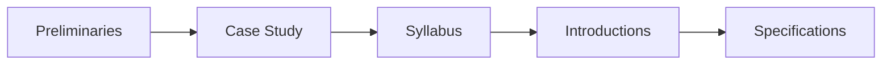
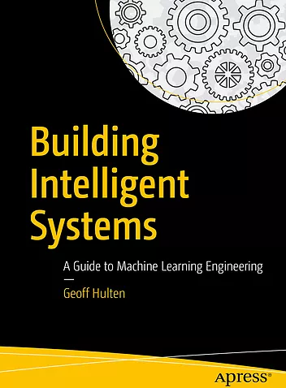
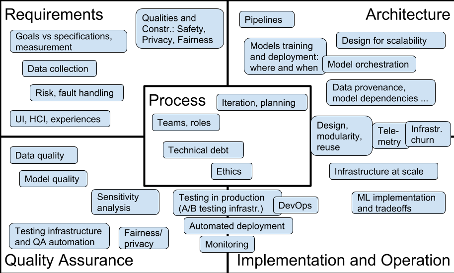
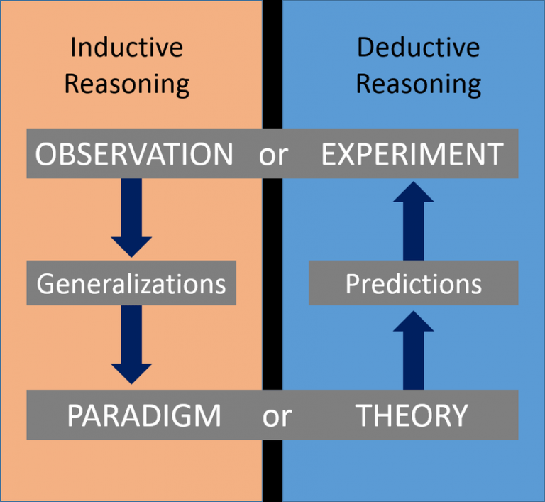

---
# Introduction and Motivation
---

# Lecture Logistics during a Pandemic

## Learning Goals

* Understand how AI components are parts of larger systems
* Illustrate the challenges in engineering an AI-enabled system beyond accuracy
* Explain the role of specifications and their lack in machine learning and the relationship to deductive and inductive reasoning
* Summarize the respective goals and challenges of software engineers vs data scientists

# Agenda



# Case Study: The Transcription Service Startup


## Transcription services

* Take audio or video files and produce text.
    - Used by academics to analyze interview text
    - Podcast show notes
    - Subtitles for videos

* State of the art: Manual transcription, often mechanical turk (1.5 $/min)

## The startup idea

PhD research on domain-specific speech recognition, that can detect technical jargon

DNN trained on public PBS interviews + transfer learning on smaller manually annotated domain-specific corpus

Research has shown amazing accuracy for talks in medicine, poverty and inequality research, and talks at Ruby programming conferences; published at top conferences

Idea: Let's commercialize the software and sell to academics and conference organizers

## Likely challenges?


<svg version="1.1" viewBox="0.0 0.0 800 400" xmlns:xlink="http://www.w3.org/1999/xlink" xmlns="http://www.w3.org/2000/svg">
        <style>
    text { font: 60px sans-serif; }
        </style>
        <circle r="180" cx="250", cy="200" fill="#b9ff00" fill-opacity="0.514" />
        <circle r="180" cx="550", cy="200" fill="#ff5500" fill-opacity="0.514" />
        <text x=230 y=160 dominant-baseline="middle" text-anchor="middle">Data</text>
        <text x=230 y=240 dominant-baseline="middle" text-anchor="middle">Scientists</text>
        <text x=570 y=160 dominant-baseline="middle" text-anchor="middle">Software</text>
        <text x=570 y=240 dominant-baseline="middle" text-anchor="middle">Engineers</text>
</svg>
## Data scientist

* Often fixed dataset for training and evaluation (e.g., PBS interviews)
* Focused on accuracy
* Prototyping, often Jupyter notebooks or similar 
* Expert in modeling techniques and feature engineering
* Model size, updateability, implementation stability typically does not matter

## Software engineer

* Builds a product
* Concerned about cost, performance, stability, release time
* Identify quality through customer satisfaction
* Must scale solution, handle large amounts of data
* Detect and handle mistakes, preferably automatically
* Maintain, evolve, and extend the product over long periods
* Consider requirements for security, safety, fairness

## Likely collaboration challenges?

## Qualities of Interest ("ilities")

* Quality is about more than the absence of defects
* Quality in use (effectiveness, efficiency, satisfaction, freedom of risk, ...)
* Product quality (functional correctness and completeness, performance efficiency, compatibility, usability, dependability, scalability, security, maintainability, portability, ...)
* Process quality (manageability, evolvability, predictability, ...)
* "Quality is never an accident; it is always the result of high intention, sincere effort, intelligent direction and skillful execution; it represents the wise choice of many alternatives." (many attributions)

## Garvin’s eight categories of product quality

* Performance
* Features
* Reliability
* Conformance
* Durability
* Serviceability
* Aesthetics
* Perceived Quality

Reference:
Garvin, David A., [What Does Product Quality Really Mean](http://oqrm.org/English/What_does_product_quality_really_means.pdf). Sloan management review 25 (1984).

## Relevant Qualities for Transcription Service?

# Syllabus and Class Structure

## Software engineering class

* Focused on engineering judgment
* Arguments, tradeoffs, and justification, rather than single correct answer
* "it depends..."
* Practical engagement, building systems, testing, automation
* Strong teamwork component
* Not focused on formal guarantees or machine learning fundamentals (modeling, statistics)

## Prerequisites

Some software engineering experience required

* version control

* gathering requirements

* software design and modeling

* testing and test automation

* some larger software projects in teams

* see background check quiz on Canvas

  No machine-learning knowledge required

* Will cover AI and ML basics this and next week
* If you are familiar with ML/scikit-learn those might be mostly boring... sorry.

## Textbook

Building Intelligent Systems: A Guide to Machine Learning Engineering

by Geoff Hulten

https://www.buildingintelligentsystems.com/

Most chapters assigned at some point in the semester

Supplemented with research articles, blog posts, videos, podcasts, ...

[Electronic version](https://cmu.primo.exlibrisgroup.com/permalink/01CMU_INST/6lpsnm/alma991019649190004436) in the library



## Readings and Quizzes

* Reading assignments for most lectures
  * Preparing in-class discussions
  * Background material, case descriptions, possibly also podcast, video, wikipedia
  * Complement with own research
* Short and easy online quizzes on readings, due before start of lecture

## Assignments

* Series of small to medium-sized individual assignments (mostly in first half)
    * engage with practical challenges
    * design, implement, and automate
    * reason about tradeoffs and justify your decisions
    * written reports and some coding and modeling

* Large team project with multiple milestones (mostly in second half)
    - Build and deploy prediction service
    - Testing in production
    - Monitoring

## Recitations

Typically hands on exercises, use tools, analyze cases

Often designed to prepare for assignments

First recitation tomorrow: Apache Kafka



## Aside: AI vs ML

* Artificial intelligence is an umbrella term covering symbolic AI (problem solving, reasoning) as well as machine learning (statistical learning from data)
* This course focuses mostly on *statistical machine learning* and supervised learning (extrapolating from data, inductive reasoning)
* We will cover *symbolic AI* (expert systems, probabilistic reasoning, ...) selectively, often for contrast

# Correctness and Specifications

# Deductive vs. Inductive Reasoning

## Who is to blame?

```java
Algorithms.shortestDistance(g, "Tom", "Anne");

> ArrayOutOfBoundsException
```

```java
Algorithms.shortestDistance(g, "Tom", "Anne");

> -1
```

## Who is to blame?

```java
class Algorithms {
    /**
     * This method finds the shortest distance between to 
     * verticies. It returns -1 if the two nodes are not 
     * connected. 
    */
    int shortestDistance(…) {…}
}
```
```java
class Algorithms {
    /**
     * This method finds the shortest distance between to 
     * verticies. Method is only supported 
     * for connected verticies.
    */
    int shortestDistance(…) {…}
} //如果用户在明知precondition的情况下，胡乱调用，那就是用户自己的锅
```

## System decomposition with interfaces

```java
/*@ requires amount >= 0;
    ensures balance == \old(balance)-amount &&
            \result == balance;
@*/
public int debit(int amount) {
    ...
}
```
(JML specification in Java, pre- and postconditions)

```java
/**
  * Calls the <code>read(byte[], int, int)</code> overloaded [...]
  * @param buf The buffer to read bytes into
  * @return The value retured from <code>in.read(byte[], int, int)</code>
  * @exception IOException If an error occurs
  */
public int read(byte[] buf) throws IOException
{
    return read(buf, 0, buf.length);
}
```
(textual specification with JavaDoc)

## Contracts/Specifications

* Contracts describe expected behavior for methods, while hiding the implementation behind
* States method's and caller's responsibilities
* Analogy: legal contract
    * If you pay me this amount on this schedule...
    * I will build the following...
    * Some contracts have remedies for nonperformance
* Invariants must hold before and after loop/method execution
* Defines what it means for implementation to be correct, including exceptional behavior

## Who is to blame?

```java
Math.sqrt(-5);

> 0
```
## Benefits of Specifications

* Exact specification of what should be implemented
* Decompose a system into its parts, develop and test parts independently
* Accurate blame assignments and identification of buggy behavior
* Useful for test generation and as test oracle

## Specifications in Machine Learning?

```java
/**
  ????
*/
String transcribe(File audioFile);
```

## Specifications in Machine Learning?


```java
/**
  ????
*/
List<Product> suggestedPurchases(List<Product> pastPurchases);
```

## Specifications in Machine Learning?


```java
/**
  ????
*/
Boolean predictRecidivism(int age, 
                          List<Crime> priors, 
                          Gender gender, 
                          int timeServed,
                          ...);
```

## Specifications in Machine Learning?

* Usually clear specifications do not exist -- we use machine learning exactly because we do not know the specifications
* Can define correctness for some data, but not general rules; sometimes can only determine correctness after the fact
* Learning for tasks for which we cannot write specifications
    - Too complex
    - Rules unknown（比如，我们就是不知道怎么判定，符合怎样条件，才能释放犯人）
* AI will learn rules/specifications, often not in a human-readable form, but are those the right ones?
* Often *goals* used instead --> maximize a specific objective

[](https://danielmiessler.com/blog/the-difference-between-deductive-and-inductive-reasoning/)

## Deductive Reasoning

* Combining logical statements following agreed upon rules to form new statements
* Proving theorems from axioms
* From general to the particular
* *mathy reasoning, eg. proof that π is irrational*
* Formal methods, classic rule-based AI systems, expert systems

## Inductive Reasoning

* Constructing axioms from observations
* Strong evidence suggests a rule
* From particular to the general
* *sciency reasoning, eg. finding laws of nature*
* Most modern machine learning systems, statistical learning

## Resulting Shift in Design Thinking?

From deductive reasoning to inductive reasoning...

From clear specifications to goals...（我们再也不能证明一个系统（含有ML部件）的正确性了）

From guarantees to best effort...

**What does this mean for software engineering?**

**For decomposing software systems?** 

**For correctness of AI-enabled systems?** 

**For safety?**

**For design, implementation, testing, deployment, operations?**

## A Touch of Realism

While it is possible to formally specify programs and prove them correct, this is rarely ever done.

In practice, specifications are often textual, local, weak, vague, or ambiguous, if they exist at all. Some informal requirements and some tests might be the only specifications available.

Software engineers have long development methods to deal with uncertainty, missing specifications, and unreliable components.

**AI may raise the stakes, but the problem and solutions are not entirely new.**

# Summary

* *Data scientists* and *software engineers* have different goals and focuses
  * Building systems requires both
  * Various qualities are relevant, beyond just accuracy
* Inductive reasoning and lack of specifications

