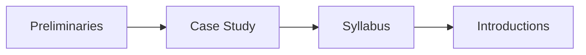
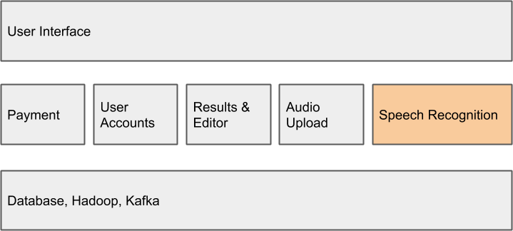
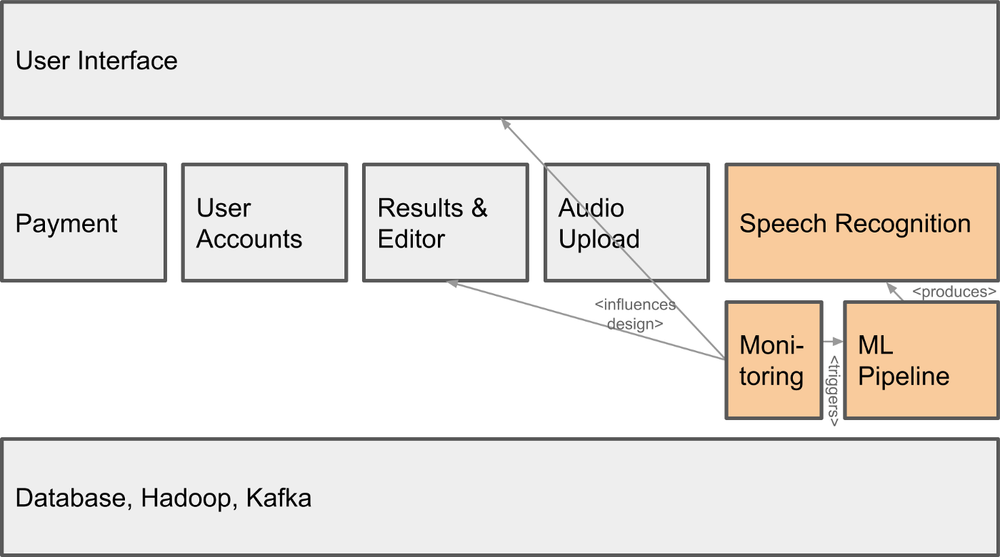
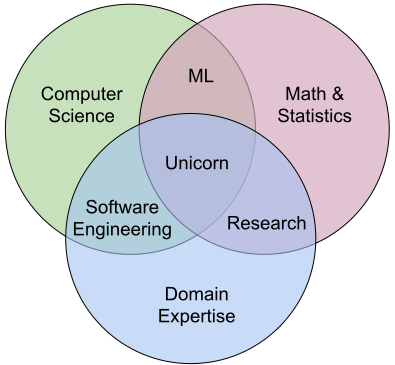
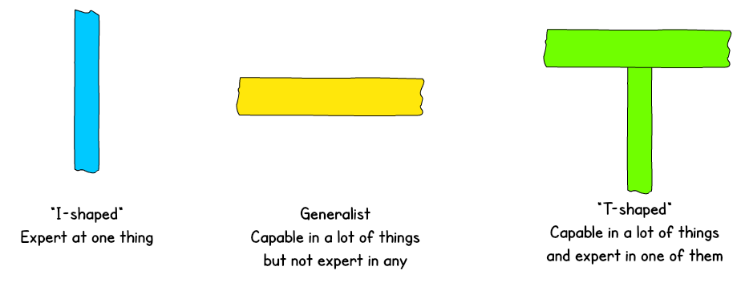

# Learning Goals

* Understand how AI components are parts of larger systems
* Illustrate the challenges in engineering an AI-enabled system beyond accuracy
* Explain the role of specifications and their lack in machine learning and the relationship to deductive and inductive reasoning
* Summarize the respective goals and challenges of software engineers vs data scientists
* Explain the concept and relevance of "T-shaped people

---

# Agenda

---

# Case Study: The Transcription Service Startup

----

----

## Transcription services

* Take audio or video files and produce text.
    - Used by academics to analyze interview text
    - Podcast show notes
    - Subtitles for videos

* State of the art: Manual transcription, often mechanical turk (1.5 $/min)

----

## The startup idea

PhD research on domain-specific speech recognition, that can detect technical jargon

DNN trained on public PBS interviews + transfer learning on smaller manually annotated domain-specific corpus

Research has shown amazing accuracy for talks in medicine, poverty and inequality research, and talks at Ruby programming conferences; published at top conferences

Idea: Let's commercialize the software and sell to academics and conference organizers

## ML in a Production System

----
## ML in a Production System

----

<svg version="1.1" viewBox="0.0 0.0 800 400" xmlns:xlink="http://www.w3.org/1999/xlink" xmlns="http://www.w3.org/2000/svg">
        
        <circle r="180" cx="250", cy="200" fill="#b9ff00" fill-opacity="0.514" />
        <circle r="180" cx="550", cy="200" fill="#ff5500" fill-opacity="0.514" />
        <text x=230 y=160 dominant-baseline="middle" text-anchor="middle">Data</text>
        <text x=230 y=240 dominant-baseline="middle" text-anchor="middle">Scientists</text>
        <text x=570 y=160 dominant-baseline="middle" text-anchor="middle">Software</text>
        <text x=570 y=240 dominant-baseline="middle" text-anchor="middle">Engineers</text>
</svg>
----
## Data scientist

* Often fixed dataset for training and evaluation (e.g., PBS interviews)
* Focused on accuracy
* Prototyping, often Jupyter notebooks or similar 
* Expert in modeling techniques and feature engineering
* Model size, updateability, implementation stability typically does not matter

## Software engineer

* Builds a product
* Concerned about cost, performance, stability, release time
* Identify quality through customer satisfaction
* Must scale solution, handle large amounts of data
* Detect and handle mistakes, preferably automatically
* Maintain, evolve, and extend the product over long periods
* Consider requirements for security, safety, fairness

## What might Software Engineers and Data Scientists Focus on?

## T-Shaped People

*Broad-range generalist + Deep expertise*

Figure: Jason Yip. [Why T-shaped people?](https://medium.com/@jchyip/why-t-shaped-people-e8706198e437). 2018

----
## T-Shaped People

*Broad-range generalist + Deep expertise*

Example:
* Basic skills of software engineering, business, distributed computing, and communication
* Deep skills in deep neural networks (technique) and medical systems (domain)

## Class with software engineering flavor

* Focused on engineering judgment
* Arguments, tradeoffs, and justification, rather than single correct answer 
* "it depends..."
* Practical engagement, building systems, testing, automation
* Strong teamwork component
* Not focused on formal guarantees or machine learning fundamentals (modeling, statistics)
* Both text-based and code-based homework assignments

----

## Prerequisites

* Teamwork experience in product team is useful but not required
* No required exposure to requirements, software testing, software design, continuous integration, containers, process management, etc 
    * if you are familiar with these, there will be some redundancy -- sorry

----

----
## Textbook

Building Intelligent Systems: A Guide to Machine Learning Engineering

by Geoff Hulten

https://www.buildingintelligentsystems.com/

Most chapters assigned at some point in the semester

Supplemented with research articles, blog posts, videos, podcasts, ...

[Electronic version](https://cmu.primo.exlibrisgroup.com/permalink/01CMU_INST/6lpsnm/alma991019649190004436) in the library

----

## Readings and Quizzes

* Reading assignments for most lectures
  * Preparing in-class discussions
  * Background material, case descriptions, possibly also podcast, video, wikipedia
  * Complement with own research
* Short essay questions on readings, with partner, due before start of lecture (Canvas quiz)
* Planned for: about 30-45 min for reading, 15 min for discussing and answering quiz

----

## Assignments

* All assignments on GitHub
* Series of 4 small to medium-sized individual assignments 
    * engage with practical challenges
    * analyze risks, fairness
    * reason about tradeoffs and justify your decisions
    * mostly written reports, a little modeling, limited coding
    * Pandemic option: may be done with partner

* Large team project with 4 milestones (mostly in second half)
    - Build and deploy prediction service
    - Testing in production, monitoring
    - Final presentation

* Usually due Wednesday night, see schedule.

----
## Recitations

Typically hands on exercises, use tools, analyze cases

Designed to introduce tools and discuss material relevant for assignments

First recitation on Friday: remote work and collaboration + Git

----

## Grading

* 40% individual assignment
* 30% group project with final presentation
* 10% midterm
* 10% participation
* 10% reading quizzes
* no final exam
*
* expected grade cutoffs: 81-90% B, 91-100% A

----
## Grading Philosophy

* Specification grading, based in adult learning theory
* Giving you choices in what to work on or how to prioritize your work
* We are making every effort to be clear about expectations (specifications)
* Assignments broken down into expectations with point values, each graded **pass/fail**
* You should be able to tell what grade you will get for an assignment when you submit it, depending on what work you chose to do
* Opportunities to resubmit work until last day of class

[[Example]](https://github.com/ckaestne/seai/blob/S2021/assignments/I1_case_study.md#grading)

## Group project

* Instructor-assigned teams
* Teams stay together for project throughout semester, starting next week
* Please fill out survey after class
* Some advice in lecture + we'll help with debugging team issues
* Peer grading on all milestones (based on citizenship on team)

----
## Additional groupwork options

* Encouraging interactions during remote learning
* Can complete all individual assignments and quizzes as pairs 
* Need to switch partner every 2 weeks; we post recommended pairings on Canvas
* Bonus points for considering collaboration on individual assignments
* Bonus points for social interaction in project teams

# Summary

* Machine learning components are part of larger systems
* *Data scientists* and *software engineers* have different goals and focuses
  * Building systems requires both
  * Various qualities are relevant, beyond just accuracy
