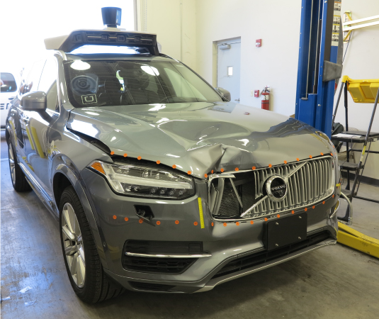
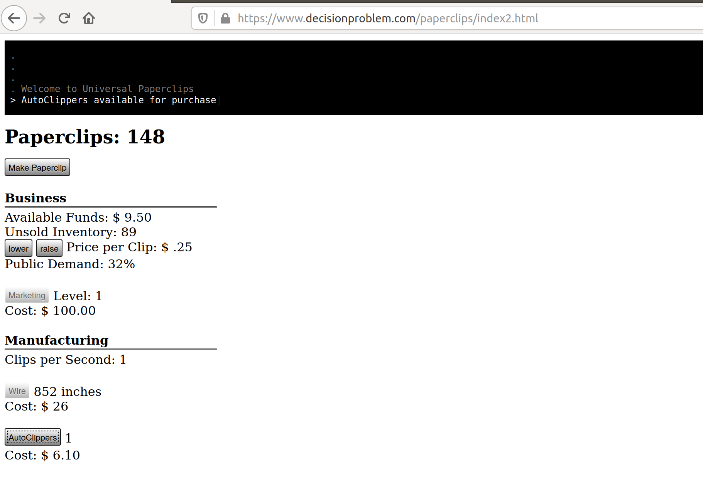
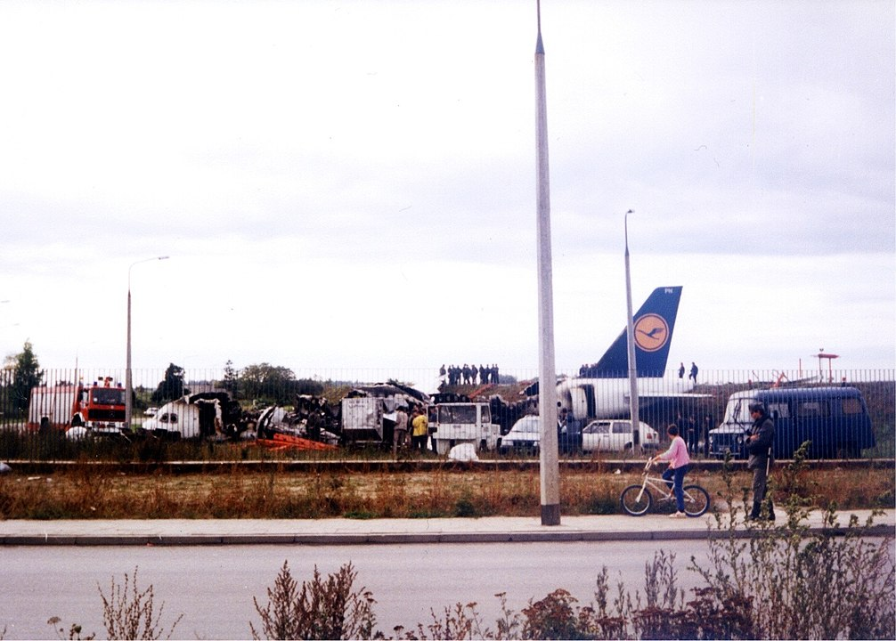

## Learning goals:

* Analyze how mistake in an AI component can influence the behavior of a system
* Analyze system requirements at the boundary between the machine and world
* Evaluate risk of a mistake from the AI component using fault trees
* Design and justify a mitigation strategy for a concrete system

---
# Wrong Predictions

----


<!-- .element: class="stretch" -->

----



----
> Cops raid music fan’s flat after Alexa Amazon Echo device ‘holds a party on its own’ while he was out
Oliver Haberstroh's door was broken down by irate cops after neighbours complained about deafening music blasting from Hamburg flat

https://www.thesun.co.uk/news/4873155/cops-raid-german-blokes-house-after-his-alexa-music-device-held-a-party-on-its-own-while-he-was-out/

> News broadcast triggers Amazon Alexa devices to purchase dollhouses.

https://www.snopes.com/fact-check/alexa-orders-dollhouse-and-cookies/

----


----


----
## Your Examples?

<!-- discussion -->


---
# Sources of Wrong Predictions

----
## Sources of Wrong Predictions?

<!-- discussion -->


----
## Correlation vs Causation


----
## Confounding Variables

<!-- colstart -->
```mermaid
graph TD;
IV[Independent Var.] -.->|spurious correlation| DV[Dependent Var.]
CV[Confounding Var.] -->|causal| DV
CV -->|causal| IV
```
<!-- col -->
```mermaid
graph TD;
IV[Coffee] -.->|spurious correlation| DV[Cancer]
CV[Smoking] -->|causal| DV
CV -->|causal| IV
```
<!-- colend -->

----
## Hidden Confounds


Note: ML algorithms may pick up on things that do not relate to the task but correlate with the outcome or hidden human inputs. For example, in cancer prediction, ML models have picked up on the kind of scanner used, learning that mobile scanners were used for particularly sick patients who could not be moved to the large installed scanners in a different part of the hospital.


----
## Reverse Causality


Note: (from Prediction Machines, Chapter 6) Early 1980s chess  program learned from Grandmaster games, learned that sacrificing queen would be a winning move, because it was occuring frequently in winning games. Program then started to sacrifice queen early.


----
## Reverse Causality


Note: (from Prediction Machines, Chapter 6) Low hotel prices in low sales season. Model might predict that high prices lead to higher demand.


----
## Missing Counterfactuals


Note: Training data often does not indicate what would have happened with different situations, thus identifying causation is hard


----
## Other Issues

* Insufficient training data
* Noisy training data
* Biased training data
* Overfitting
* Poor model fit, poor model selection, poor hyperparameters
* Missing context, missing important features
* Noisy inputs
* "Out of distribution" inputs


----
## Another Perspective: What do we know?

<!-- smallish -->

* Known knowns: 
    - Rich data available, models can make confident predictions near training data
* Known unknowns (known risks):
    - We know that model's predictions will be poor; we have too little relevant training data, problem too hard
    - Model may recognize that its predictions are poor (e.g., out of distribution)
    - Humans are often better, because they can model the problem and make analogies
* Unknown unknowns:
    - "Black swan events", unanticipated changes could not have been predicted
    - Neither machines nor humans can predict these
* Unknown knowns:
    - Model is confident about wrong answers, based on picking up on wrong relationships (reverse causality, omitted variables) or attacks on the model

**Examples?**

<!-- references -->
🕮 Ajay Agrawal, Joshua Gans, Avi Goldfarb. “[Prediction Machines: The Simple Economics of Artificial Intelligence](https://cmu.primo.exlibrisgroup.com/permalink/01CMU_INST/6lpsnm/alma991019698987304436)” 2018, Chapter 6


Notes: Examples:
* Known knowns: many current AI applications, like recommendations, navigation, translation
* Known unknowns: predicting elections, predicting value of merger 
* Unknown unknown: new technology (mp3 file sharing), external disruptions (pandemic)
* Unknown knowns: chess example (sacrificing queen detected as promising move), book making you better at a task?


----


---
# Accepting that Mistakes will Happen

----
## ML Models make Crazy Mistakes

* Humans often make predicable mistakes
    * most mistakes near to correct answer, distribution of mistakes
* ML models may be wildly wrong when they are wrong
    - especially black box models may use (spurious) correlations humans would never think about
    - may be very confident about wrong answer
    - "fixing" one mistake may cause others


----
## Accepting Mistakes

* Never assume all predictions will be correct or close
* Always expect random, unpredictable mistakes to some degree, including results that are wildly wrong
* Best efforts at more data, debugging, "testing" likely will not eliminate the problem

Hence: **Anticipate existence of mistakes, focus on worst case analysis and mitigation outside the model -- system perspective needed**

Alternative paths: symbolic reasoning, interpretable models, and restricting predictions to "near" training data

----
## Recall: Experience/UI Design

Balance forcefulness (automate, prompt, organize, annotate), frequency of interactions


<!-- .element: class="stretch" -->

----
## Recall: System-level Safeguards

<!-- colstart -->

<!-- col -->

<!-- colend -->

<!-- references -->
(Image CC BY-SA 4.0, C J Cowie)


---
# Common Strategies to Handle Mistakes

----
## Guardrails

*Software or hardware overrides outside the AI component*


----
## Redundancy and Voting

*Train multiple models, combine with heuristics, vote on results*

- Ensemble learning, reduces overfitting
- May learn the same mistakes, especially if data is biased
- Hardcode known rules (heuristics) for some inputs -- for important inputs

**Examples?**

----
## Human in the Loop

*Less forceful interaction, making suggestions, asking for confirmation*

* AI and humans are good at predictions in different settings
    - e.g., AI better at statistics at scale and many factors; humans understand context and data generation process and often better with thin data (see *known unknowns*)
* AI for prediction, human for judgment?
* But
    * Notification fatigue, complacency, just following predictions; see *Tesla autopilot*
    * Compliance/liability protection only?
* Deciding when and how to interact
* Lots of UI design and HCI problems


**Examples?**

Notes: Cancer prediction, sentencing + recidivism, Tesla autopilot, military "kill" decisions, powerpoint design suggestions

----
## Undoable Actions

*Design system to reduce consequence of wrong predictions, allowing humans to override/undo*

**Examples?**

Notes: Smart home devices, credit card applications, Powerpoint design suggestions

----
## Review Interpretable Models

*Use interpretable machine learning and have humans review the rules*

```txt
IF age between 18–20 and sex is male THEN predict arrest
ELSE IF age between 21–23 and 2–3 prior offenses THEN predict arrest
ELSE IF more than three priors THEN predict arrest
ELSE predict no arrest
```

-> Approve the model as specification


---
# Risk Analysis

(huge field, many established techniques; here overview only)

----
## What's the worst that could happen?


*Likely?*

Toby Ord predicts existential risk from GAI at 10% within 100 years

<!-- references -->

Toby Ord, "The Precipice: Existential Risk and the Future of Humanity", 2020

Note: Discussion on existential risk. Toby Ord, Oxford philosopher predicts 

----
[](https://www.decisionproblem.com/paperclips/index2.html)

----
## What is Risk Analysis?

*  What can possibly go wrong in my system, and what are potential 
impacts on system requirements?
* Risk = Likelihood * Impact
* Many established methods:
  * Failure mode & effects analysis (FMEA)
  * Hazard analysis
  * Why-because analysis
  * Fault tree analysis (FTA)
  * Hazard and Operability Study (HAZOP)
  * ...

----

## Risks?

* Lane assist system
* Credit rating
* Amazon product recommendation
* Audio transcription service
* Cancer detection
* Predictive policing

**Discuss potential risks, including impact and likelyhood**

<!-- discussion -->


  
----
## Fault Tree Analysis (FTA)

* Fault tree: A top-down diagram that displays the relationships
between a system failure (i.e., requirement violation) and its potential causes.  
  * Identify sequences of events that result in a failure
  * Prioritize the contributors leading to the failure
  * Inform decisions about how to (re-)design the system
  * Investigate an accident & identify the root cause 
* Often used for safety & reliability, but can also be used for
other types of requirement (e.g., poor performance, security attacks...)


----
## Fault Tree Example


* Every tree begins with a TOP event (typically a violation of a requirement)
* Every branch of the tree must terminate with a basic event

<!-- references -->
Figure from _Fault Tree Analysis and Reliability Block Diagram_
(2016), Jaroslav Menčík. 


----
## Fault Trees: Basic Building Blocks


* Event: An occurrence of a fault or an undesirable action
  * (Intermediate) Event: Explained in terms of other events
  * Basic Event: No further development or breakdown; leafs of the tree
* Gate: Logical relationship between an event & its immedicate subevents
   * AND: All of the sub-events must take place
  * OR: Any one of the sub-events may result in the parent event

<!-- references -->
Figure from _Fault Tree Analysis and Reliability Block Diagram_
(2016), Jaroslav Menčík. 

----
## Analysis

* What can we do with fault trees?
  * Qualitative analysis: Determine potential root causes of a
    failiure through _minimal cut set analysis_
  * Quantitative analysis: Compute the probability of a failure,
    based on estimated probabilities of basic events

*(cut set = set of basic events whose simultaneous occurrence is
  sufficient to guarantee that the TOP event occurs)*

<!-- split -->


Note:

* _Minimal_ cut set: A cut set from which a smaller cut set can be
obtained by removing a basic event.
* Switch failed alone is sufficient (minimal cut set), so is fused burned, whereas lamp1 + lamp2 burned is a cut set, but not minimal.


----
## Fault Tree Analysis & AI

* Anticipate mistakes and understand consequences
* How do mistakes made by AI contribute to system failures/catastrophe? 
* Increasingly used in automotive, aeronautics, industrial control systems, etc.


----
## FTA Process

1. Specify the system structure
   * Environment entities & machine components
   * Assumptions (ENV) & specifications (SPEC)
2. Identify the top event as a violation of REQ
3. Construct the fault tree
  * Intermediate events can be derived from violation of SPEC/ENV
4. Analyze the tree
  * Identify all possible minimal cut sets
5. Consider design modifications to eliminate certain cut sets
6. Repeat

----
## Exercise: Draw Fault Tree for Lane Assist

```mermaid
graph TD
    left[TOP: Car leaves lane]
```


----
## Fault-Tree Analysis Discussion

* Town-down, *backward* search for the root cause of issues
    - from final outcomes to initiating events
* Issues (TOP events) need to be known upfront
* Quantitative analysis possible
* Useful for understanding faults post-hoc
* Where do outcomes come from?

----
## Failure Mode and Effects Analysis (FMEA)


* A __forward search__ technique to identify potential hazards
* Widely used in aeronautics, automotive, healthcare, food services,
  semiconductor processing, and (to some extent) software

----
## FMEA Process

* Identify system components
* Enumerate potential failure modes
    - *for ML component: Always suspect prediction may be wrong*
* For each failure mode, identify:
  * Potential hazardous effect on the system
  * Method for detecting the failure
  * Potential mitigation strategy


----
## FMEA Example: Lane Assist

```mermaid
graph LR
Camera --> LP[LanePrediction]
SteeringStatus --> SteeringPlanning
LP --> SteeringPlanning
SteeringPlanning --> Guardian
Guardian --> SteeringActuators
Guardian --> Beeper
GyroSensor --> SteeringPlanning
GyroSensor --> Guardian
```

Failure modes? Failure effects? Detection? Mitigation?

Note:
More general Autonomous Vehicle example

| Component | Failure Mode | Failure Effects | Detection | Mitigation |
|---|---|---|---|---|
| Perception | Failure to detect an object | Risk of collision | Human operator (if present) | Deploy secondary classifier |
| Perception | Detected but misclassified | " | " | " |
| Lidar Sensor | Mechanical failure | Inability to detect objects | Monitor | Switch to manual control mode |
| ... | ... | ... | ... |  ... | 

----
## "Wrong Prediction" as Failure Mode?

* "Wrong prediction" is a very cause grained failure mode
* May not be possible to decompose further
* However, may evaluate causes of wrong prediction for better understanding, as far as possible --> FTA?


----
## Exercise: FMEA Analysis for Cancer Detection

Failure modes? Failure effects? Detection? Mitigation?

<!-- discussion -->


----
## FMEA Summary

* Forward analysis: From components to possible failures
* Focus on single component failures, no interactions
* Identifying failure modes may require domain understanding

----
## Hazard and Interoperability Study (HAZOP)
   
*identify hazards and component fault scenarios through guided inspection of requirements*


---
# Decomposing Requirements to Understand Problems

----
## The Role of Requirements Engineering

* Requirements engineering essential to understand risks and mistake mitigation
* Understand 
    * user interactions
    * safety requirements
    * security and privacy requirements
    * fairness requirements
    * possible feedback loops

----
## Machine vs World


* No software lives in vacuum; every system is deployed as part of the world
* A requirement describes a desired state of the world (i.e., environment)
* Machine (software) is _created_ to manipulate the environment into
  this state 

----
## Shared Phenomena


* Shared phenomena: Interface between the world & machine (actions,
  events, dataflow, etc.,)
* Requirements (REQ) are expressed only in terms of world phenomena 
* Assumptions (ENV) are expressed in terms of world & shared phenomena
* Specifications (SPEC) are expressed in terms of machine & shared phenomena


----
## Discussion: Machine vs World


**Discuss examples for self-driving car, Amazon product recommendation, smart toaster**

----
## Example: Lane Assist


<!-- .element: class="stretch" -->

* Requirement: Car should beep when exiting lane / adjust steering to stay in lane
* Environment assumptions: ??
* Specifications: ??

Notes:
ENV: Engine is working as intended; sensors are providing accurate information about the leading car (current speed, distance...)
SPEC: Depending on the sensor readings, the controller must issue an actuator command to beep/steer the vehicle as needed.

----
## Recall: Lack of Specifications for AI components

* In addition to world vs machine challenges
* We do not have clear specifications for AI components
    - goals, average accuracy
    - at best probabilistic specifications in some symbolic AI techniques
* Viewpoint: Machine learning techniques mine specifications from data, but not usually understandable 


----
## What could go wrong?


* Missing/incorrect environmental assumptions (ENV)
* Wrong specification (SPEC)
* Inconsistency in assumptions & spec (ENV ∧ SPEC = False)
* Inconsistency in requirements (REQ = False)

----
## Non-AI Example: Lufthansa 2904 Runway Crash


<!-- .element: class="stretch" -->


* Reverse thrust (RT): Decelerates plane during landing
* What was required (REQ): RT enabled if and only if plane on the ground
* What was implemented (SPEC): RT enabled if and only if wheel turning
* But: Runway wet + wind, wheels did not turn, pilot overridden by software

Notes: For more details see https://en.wikipedia.org/wiki/Lufthansa_Flight_2904; Image credit [Mariusz Siecinski](https://en.wikipedia.org/wiki/Lufthansa_Flight_2904#/media/File:Lufthansa_Flight_2904_crash_site_Siecinski.jpg)

----
## Feedback Loops and Adversaries


<!-- .element: class="stretch" -->

* Feedback loops: Behavior of the machine affects the world, which affects inputs to the machine
* Data drift: Behavior of the world changes over time, assumptions no longer valid
* Adversaries: Bad actors deliberately may manipulate inputs, violate environment assumptions

**Examples?**


----
## Implications on Software Development

* Software/AI alone cannot establish system requirements -- they are just one part of the system
* Environmental assumptions are just as critical
  * But typically you can't modify these
  * Must design SPEC while treating ENV as given
* If you ignore/misunderstand these, your system may fail to satisfy
  its requirements

----
## Deriving SPEC from REQ

1. Identify environmental entities and machine components
2. State a desired requirement (REQ) over the environment
3. Identify the interface between the environment & machines
4. Identify the environmental assumptions (ENV)
5. Develop software specifications (SPEC) that are sufficient to establish REQ
6. Check whether ENV ∧ SPEC ⊧ REQ
7. If NO, strengthen SPEC & repeat Step 6


---
# Summary

* Accept that ML components will confidently make mistakes
* Many reasons for wrong predictions (poor data, reverse causation, ...)
* Plan for mistakes
    - System-level safeguards
    - Human computer interaction, interface design
* Understand world-machine interactions
* Use Risk/Hazard analysis to identify and mitigate potential problems 