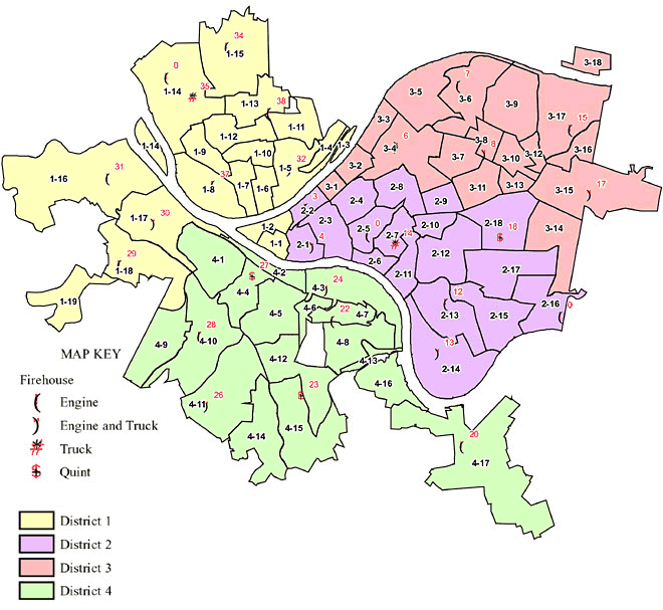
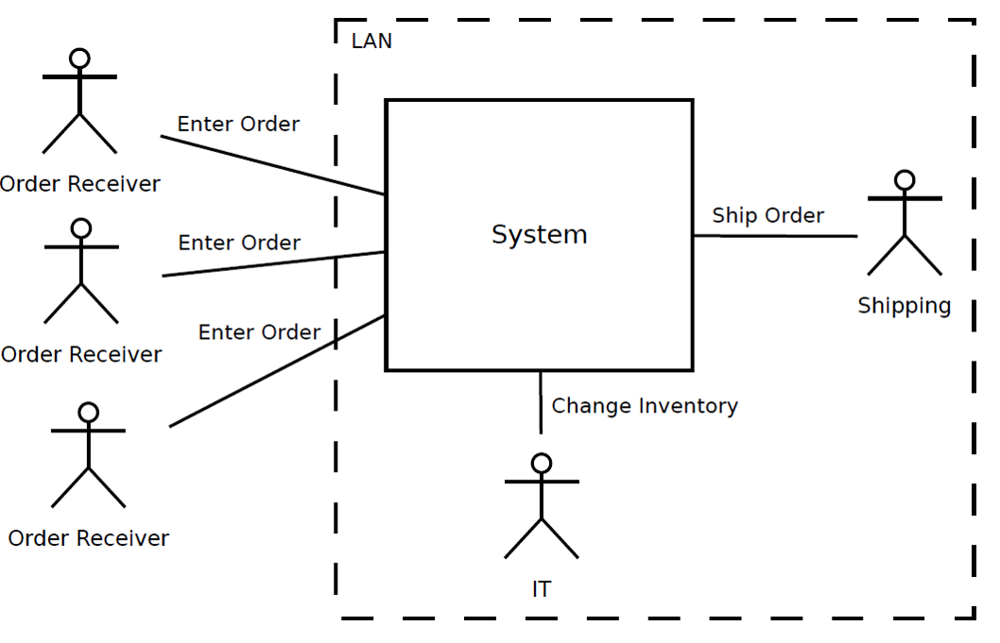
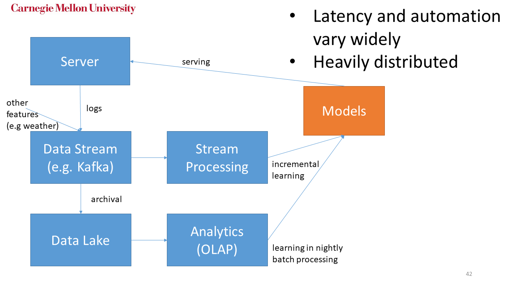
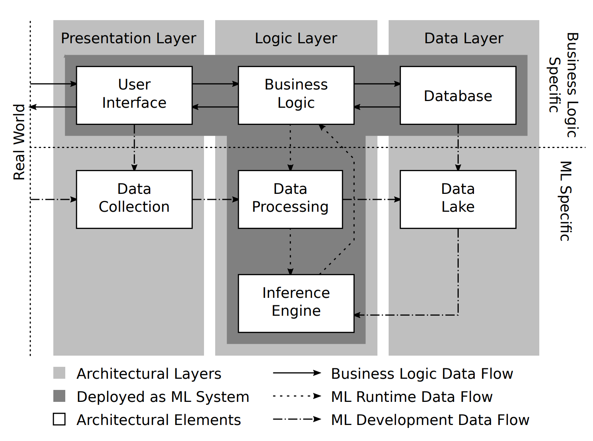

# Software Architecture of AI-enabled Systems

Christian Kaestner

<!-- references -->

Required reading: 
* 🕮 Hulten, Geoff. "[Building Intelligent Systems: A Guide to Machine Learning Engineering.](https://www.buildingintelligentsystems.com/)" Apress, 2018, Chapter 13 (Where Intelligence Lives).
* 📰 Daniel Smith. "[Exploring Development Patterns in Data Science](https://www.theorylane.com/2017/10/20/some-development-patterns-in-data-science/)." TheoryLane Blog Post. 2017.

Recommended reading: Rick Kazman, Paul Clements, and Len Bass. [Software architecture in practice.](https://www.oreilly.com/library/view/software-architecture-in/9780132942799/?ar) Addison-Wesley Professional, 2012, Chapter 1

---

# Learning Goals

* Understand important quality considerations when using ML components
* Follow a design process to explicitly reason about alternative designs and their quality tradeoffs
* Gather data to make informed decisions about what ML technique to use and where and how to deploy it
*
* Create architectural models to reason about relevant characteristics
* Critique the decision of where an AI model lives (e.g., cloud vs edge vs hybrid), considering the relevant tradeoffs 
* Deliberate how and when to update models and how to collect telemetry

---

# Software Architecture 

```mermaid
graph LR;
Requirements --> m((Miracle / genius developers))
m --> Implementation
```

----

# Software Architecture 

```mermaid
graph LR;
Requirements --> Architecture
Architecture --> Implementation
```

Focused on reasoning about tradeoffs and desired qualities
----
## Software Architecture

> The software architecture of a program or computing system is the **structure or structures** of the system, which comprise **software elements**, the ***externally visible properties*** of those elements, and the relationships among them.
> -- [Kazman et al. 2012](https://www.oreilly.com/library/view/software-architecture-in/9780132942799/?ar)

----

## Why Architecture? ([Kazman et al. 2012](https://www.oreilly.com/library/view/software-architecture-in/9780132942799/?ar))

* Represents earliest design decisions.
* Aids in **communication** with stakeholders
    * Shows them “how” at a level they can understand, raising questions about whether it meets their needs
* Defines **constraints** on implementation
    * Design decisions form “load-bearing walls” of application
* Dictates **organizational structure**
    * Teams work on different components
* Inhibits or enables **quality attributes**
    * Similar to design patterns
* Supports **predicting** cost, quality, and schedule
    * Typically by predicting information for each component
* Aids in software **evolution**
    * Reason about cost, design, and effect of changes
* Aids in **prototyping**
    * Can implement architectural skeleton early

----

## Case Study: Twitter

Note: Source and additional reading: Raffi. [New Tweets per second record, and how!](https://blog.twitter.com/engineering/en_us/a/2013/new-tweets-per-second-record-and-how.html) Twitter Blog, 2013

----

## Twitter - Caching Architecture

<!-- .element: class="stretch" -->

Notes:

* Running one of the world’s largest Ruby on Rails installations
* 200 engineers
* Monolithic: managing raw database, memcache, rendering the site, and * presenting the public APIs in one codebase
* Increasingly difficult to understand system; organizationally challenging to manage and parallelize engineering teams
* Reached the limit of throughput on our storage systems (MySQL); read and write hot spots throughout our databases
* Throwing machines at the problem; low throughput per machine (CPU + RAM limit, network not saturated)
* Optimization corner: trading off code readability vs performance

----

## Twitter's Redesign Goals

* Performance
    * Improve median latency; lower outliers 
    * Reduce number of machines 10x
+ Reliability
    * Isolate failures
+ Maintainability
    * "We wanted cleaner boundaries with “related” logic being in one place": 
encapsulation and modularity at the systems level (rather than at the class, module, or package level)
* Modifiability
    * Quicker release of new features: "run small and empowered engineering teams that could make local decisions and ship user-facing changes, independent of other teams"

<!-- references -->

Raffi. [New Tweets per second record, and how!](https://blog.twitter.com/engineering/en_us/a/2013/new-tweets-per-second-record-and-how.html) Twitter Blog, 2013

----

## Twitter: Redesign Decisions

* Ruby on Rails -> JVM/Scala 
* Monolith -> Microservices
* RPC framework with monitoring, connection pooling, failover strategies, loadbalancing, ... built in
* New storage solution, temporal clustering, "roughly sortable ids"
* Data driven decision making

<!-- split -->

<!-- .element: class="stretch" -->

----

## Twitter Case Study: Key Insights

* Architectural decisions affect entire systems, not only individual modules
* Abstract, different abstractions for different scenarios
* Reason about quality attributes early
* Make architectural decisions explicit
* Question: **Did the original architect make poor decisions?**

---

# Architectural Modeling and Reasoning
----

Notes: Map of Pittsburgh. Abstraction for navigation with cars.
----

Notes: Cycling map of Pittsburgh. Abstraction for navigation with bikes and walking.
----

Notes: Fire zones of Pittsburgh. Various use cases, e.g., for city planners.
----
## Analysis-Specific Abstractions

* All maps were abstractions of the same real-world construct
* All maps were created with different goals in mind
    - Different relevant abstractions
    - Different reasoning opportunities
* 
* Architectural models are specific system abstractions, for reasoning about specific qualities
* No uniform notation

----

## What can we reason about?

<!-- .element: class="stretch" -->

----

## What can we reason about?

<!-- references -->
Ghemawat, Sanjay, Howard Gobioff, and Shun-Tak Leung. "[The Google file system.](https://ai.google/research/pubs/pub51.pdf)" ACM SIGOPS operating systems review. Vol. 37. No. 5. ACM, 2003.

Notes: Scalability through redundancy and replication; reliability wrt to single points of failure; performance on edges; cost

----
## What can we reason about?

<!-- references -->
Peng, Zi, Jinqiu Yang, Tse-Hsun Chen, and Lei Ma. "A first look at the integration of machine learning models in complex autonomous driving systems: a case study on Apollo." In Proceedings of the 28th ACM Joint Meeting on European Software Engineering Conference and Symposium on the Foundations of Software Engineering, pp. 1240-1250. 2020.

----

## Modeling Recommendations

* Use notation suitable for analysis
* Document meaning of boxes and edges in legend
* Graphical or textual both okay; whiteboard sketches often sufficient
* Formal notations available

---

# Case Study: Augmented Reality Translation

<!-- .element: class="stretch" -->

Notes: Image: https://pixabay.com/photos/nightlife-republic-of-korea-jongno-2162772/

----
## Case Study: Augmented Reality Translation

----
## Case Study: Augmented Reality Translation

Notes: Consider you want to implement an instant translation service similar toGoogle translate, but run it on embedded hardware in glasses as an augmented reality service.
----
## Qualities of Interest?

<!-- discussion -->

---
# Architectural Decision: Selecting AI Techniques

What AI techniques to use and why? Tradeoffs?

Notes: Relate back to previous lecture about AI technique tradeoffs, including for example
Accuracy
Capabilities (e.g. classification, recommendation, clustering…)
Amount of training data needed
Inference latency
Learning latency; incremental learning?
Model size
Explainable? Robust?

---
# Architectural Decision: Where Should the Model Live?

----
## Where Should the Model Live?

* Glasses
* Phone
* Cloud

What qualities are relevant for the decision?

<!-- split -->

Notes: Trigger initial discussion

----
## Considerations

* How much data is needed as input for the model?
* How much output data is produced by the model?
* How fast/energy consuming is model execution?
* What latency is needed for the application?
* How big is the model? How often does it need to be updated?
* Cost of operating the model? (distribution + execution)
* Opportunities for telemetry?
* What happens if users are offline?

----
## Exercise: Latency and Bandwidth Analysis of AR Translation

1. Identify key components of a solution and their interactions

2. Estimate latency and bandwidth requirements between components

3. Discuss tradeoffs among different deployment models

<!-- discussion -->

Notes: Identify at least OCR and Translation service as two AI components in a larger system. Discuss which system components are worth modeling (e.g., rendering, database, support forum). Discuss how to get good estimates for latency and bandwidth.

Some data:
200ms latency is noticable as speech pause; 
20ms is perceivable as video delay, 10ms as haptic delay;
5ms referenced as cybersickness threshold for virtual reality
20ms latency might be acceptable

bluetooth latency around 40ms to 200ms

bluetooth bandwidth up to 3mbit, wifi 54mbit, video stream depending on quality 4 to 10mbit for low to medium quality

google glasses had 5 megapixel camera, 640x360 pixel screen, 1 or 2gb ram, 16gb storage

----
## When would one use the following designs?

* Static intelligence in the product
* Client-side intelligence
* Server-centric intelligence
* Back-end cached intelligence
* Hybrid models

Notes:
From the reading:
* Static intelligence in the product
    - difficult to update
    - good execution latency
    - cheap operation
    - offline operation
    - no telemetry to evaluate and improve
* Client-side intelligence
    - updates costly/slow, out of sync problems
    - complexity in clients
    - offline operation, low execution latency
* Server-centric intelligence
    - latency in model execution (remote calls)
    - easy to update and experiment
    - operation cost
    - no offline operation
* Back-end cached intelligence
    - precomputed common results
    - fast execution, partial offline 
    - saves bandwidth, complicated updates
* Hybrid models

----
## More Considerations

* Coupling of ML pipeline parts
* Coupling with other parts of the system
* Ability for different developers and analysts to collaborate
* Support online experiments
* Ability to monitor

---
# Architectural Decision: Telemetry Requirements
----
## Telemetry Design

How to evaluate mistakes in production?

Notes: Discuss strategies to determine accuracy in production. What kind of telemetry needs to be collected?

----
## The Right and Right Amount of Telemetry

* Purpose:
    - Monitor operation
    - Monitor mistakes (e.g., accuracy)
    - Improve models over time (e.g., detect new features)
*
* Challenges:
    - too much data
    - no/not enough data
    - hard to measure, poor proxy measures
    - rare events
    - cost
    - privacy
 
----
## Telemetry Tradeoffs

What data to collect? How much? When?

Estimate data volume and possible bottlenecks in system.

Notes: Discuss alternatives and their tradeoffs. Draw models as suitable.

Some data for context:
Full-screen png screenshot on Pixel 2 phone (1080x1920) is about 2mb (2 megapixel); Google glasses had a 5 megapixel camera and a 640x360 pixel screen, 16gb of storage, 2gb of RAM. Cellar cost are about $10/GB.

----
## Related: Cost of Data and Feature Engineering

* How much data do we acquire for training and evaluating models?
* What data sources at what scale and latency (considering engineering cost, storage cost, processing cost, license cost, ...)
* Is it worth investing more time in feature engineering? What if additional data sources are needed?
* What is the cost for cleaning, preprocessing the data and the value of the additional accuracy?

---
# Architectural Decision: Independent Model Service

Microservice architecture: 

Model Inference and Model Learning as a RESTful Service?

----
## Coupling and Changeability

What's the interface between the AI component and the rest of the system?

* Learning data and process
* Inference API
    - Where does feature extraction happen? 
    - Provide raw data (images, user profile, all past purchases) to service, grant access to shared database, or provide feature vector?
    - Cost of feature extraction? Who bears the cost?
    - Versioned interface?
* Coupling to other models? Direct coupling to data sources (e.g., files, databases)? Expected formats for raw data (e.g., image resolution)?
* Coupling to telemetry?

----
## Model Service API

Consider encapsulating the model as a microservice. Sketch a (REST) API.

----
## Infrastructure Planning (Facebook Example)

<!-- references -->

Hazelwood, Kim, Sarah Bird, David Brooks, Soumith Chintala, Utku Diril, Dmytro Dzhulgakov, Mohamed Fawzy et al. "Applied machine learning at facebook: A datacenter infrastructure perspective." In 2018 IEEE International Symposium on High Performance Computer Architecture (HPCA), pp. 620-629. IEEE, 2018.

----
## Capacity Planning (Facebook Example)

<!-- small -->

| Services | Relative Capacity | Compute | Memory |
|--|--|--|--|
| News Feed | 100x | Dual-Socket CPU | High |
| Facer (face recognition) | 10x | Single-Socket CPU | Low |
| Lumos (image understanding) | 10x | Single-Socket CPU | Low |
| Search | 10x | Dual-Socket CPU | High |
| Lang. Translation | 1x | Dual-Socket CPU | High |
| Sigma (anomaly and spam detection) | 1x | Dual-Socket CPU | High |
| Speech Recognition | 1x | Dual-Socket CPU | High |

Trillions of inferences per day, in real time

Preference for cheap single-CPU machines whether possible

Different latency requirements, some "nice to have" predictions

Some models run on mobile device to improve latency and reduce communication cost

<!-- references -->

Hazelwood, Kim, Sarah Bird, David Brooks, Soumith Chintala, Utku Diril, Dmytro Dzhulgakov, Mohamed Fawzy et al. "Applied machine learning at facebook: A datacenter infrastructure perspective." In 2018 IEEE International Symposium on High Performance Computer Architecture (HPCA), pp. 620-629. IEEE, 2018.

----
## Real-Time Serving; Many Models

<!-- references -->
Peng, Zi, Jinqiu Yang, Tse-Hsun Chen, and Lei Ma. "A first look at the integration of machine learning models in complex autonomous driving systems: a case study on Apollo." In Proceedings of the 28th ACM Joint Meeting on European Software Engineering Conference and Symposium on the Foundations of Software Engineering, pp. 1240-1250. 2020.

----
## Future-Proofing an API

* Anticipating and encapsulating change
    - What parts around the model service are likely to change?
    - Rigid vs flexible data formats?
* Versioning of APIs
    - Version numbers vs immutable services?
    - Expecting to run multiple versions in parallel? Implications for learning and evolution?

----
## Operational Robustness

* Redundancy for availability?
* Load balancer for scalability?
* Can mistakes be isolated?
    - Local error handling?
    - Telemetry to isolate errors to component?
* Logging and log analysis for what qualities?

---
# Architectural Decision: Training Infrastructure and Updating Models

* Design for change!
* Models are rarely static outside the lab
* Data drift, feedback loops, new features, new requirements
* When and how to update models?
* How to version? How to avoid mistakes?

----
## Risk of Stale Models

What could happen if models become stale?

Risk: Discuss drift, adversarial interactions, feedback loops

----
## Update Requirements or Goals

Estimate the required update frequency and the related cost regarding training, data transfer, etc.

Notes: Discuss how frequently the involved models need to be updated. Are static models acceptable? Identify what information to collect and estimate 
the relevant values.

----
## Repeated Large Training Jobs (Facebook Example)

* Ads and feed models trained on 100s of TB data
* Feed models take hours to train, image detection models for spam detection take days to train
* Custom hardware in data centers
* High priority for disaster recovery
    - Outage considered as high cost to productivity, ability to detect spam/offensive content
    - Stale news feeds and ad models have measurable impact on quality

<!-- references -->

Hazelwood, Kim, Sarah Bird, David Brooks, Soumith Chintala, Utku Diril, Dmytro Dzhulgakov, Mohamed Fawzy et al. "Applied machine learning at facebook: A datacenter infrastructure perspective." In 2018 IEEE International Symposium on High Performance Computer Architecture (HPCA), pp. 620-629. IEEE, 2018.

----
## Outlook: Big Data Designs

Stream + Batch Processing

---
# Architectural Styles / Tactics / Design Patterns for AI Enabled Systems

(no standardization, *yet*)

----
## Architectures and Patterns

* The Big Ass Script Architecture
* Decoupled multi-tiered architecture (data vs data analysis vs reporting; separate business logic from ML)
* Microservice architecture (multiple learning and inference services)
* Gateway Routing Architecture
* 
* Pipelines
* Data lake, lambda architecture
* Reuse between training and serving pipelines
* Continuous deployment, ML versioning, pipeline testing

<!-- references -->
* Daniel Smith. "[Exploring Development Patterns in Data Science](https://www.theorylane.com/2017/10/20/some-development-patterns-in-data-science/)." TheoryLane Blog Post. 2017.
* Washizaki, Hironori, Hiromu Uchida, Foutse Khomh, and Yann-Gaël Guéhéneuc. "[Machine Learning Architecture and Design Patterns](http://www.washi.cs.waseda.ac.jp/wp-content/uploads/2019/12/IEEE_Software_19__ML_Patterns.pdf)." Draft, 2019

----
## Anti-Patterns

* Big Ass Script Architecture
* Dead Experimental Code Paths
* Glue code
* Multiple Language Smell
* Pipeline Jungles
* Plain-Old Datatype Smell
* Undeclared Consumers

<!-- references -->
* Washizaki, Hironori, Hiromu Uchida, Foutse Khomh, and Yann-Gaël Guéhéneuc. "[Machine Learning Architecture and Design Patterns](http://www.washi.cs.waseda.ac.jp/wp-content/uploads/2019/12/IEEE_Software_19__ML_Patterns.pdf)." Draft, 2019
* Sculley, David, Gary Holt, Daniel Golovin, Eugene Davydov, Todd Phillips, Dietmar Ebner, Vinay Chaudhary, Michael Young, Jean-Francois Crespo, and Dan Dennison. "[Hidden technical debt in machine learning systems](http://papers.nips.cc/paper/5656-hidden-technical-debt-in-machine-learning-systems.pdf)." In Advances in neural information processing systems, pp. 2503-2511. 2015.

----
## Separating Concerns

<!-- references -->

Image source: Yokoyama, Haruki. "Machine learning system architectural pattern for improving operational stability." In 2019 IEEE International Conference on Software Architecture Companion (ICSA-C), pp. 267-274. IEEE, 2019.

----
## Example: Chatbot

<!-- references -->

Image source: Yokoyama, Haruki. "Machine learning system architectural pattern for improving operational stability." In 2019 IEEE International Conference on Software Architecture Companion (ICSA-C), pp. 267-274. IEEE, 2019.

----
## Real systems are complex

<!-- references -->
Peng, Zi, Jinqiu Yang, Tse-Hsun Chen, and Lei Ma. "A first look at the integration of machine learning models in complex autonomous driving systems: a case study on Apollo." In Proceedings of the 28th ACM Joint Meeting on European Software Engineering Conference and Symposium on the Foundations of Software Engineering, pp. 1240-1250. 2020.

---

# Summary

* Software architecture is an established discipline to reason about design alternatives
* Understand relevant quality goals 
* Problem-specific modeling and analysis: Gather estimates, consider design alternatives, make tradeoffs explicit
* Examples of important design decision:
    - modeling technique to use
    - where to deploy the model
    - how and how much telemetry to collect
    - whether and how to modularize the model service
    - when and how to update models
    - build vs buy, cloud resources

