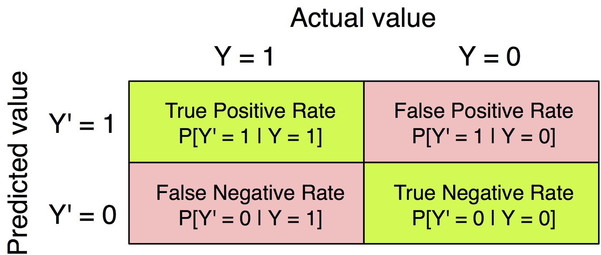
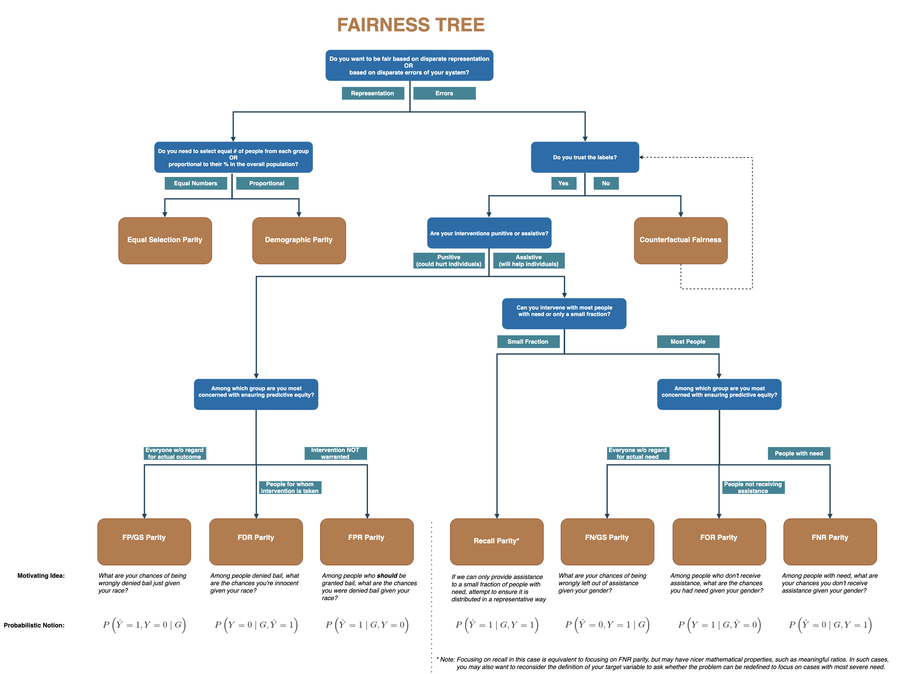
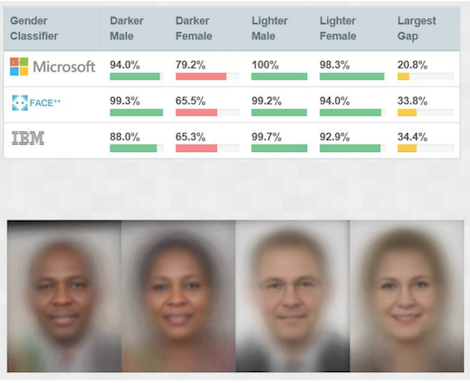
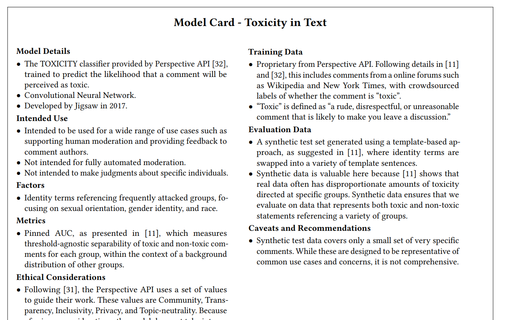
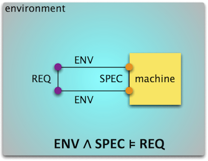

# Building Fairer AI-Enabled Systems

Christian Kaestner

(with slides from Eunsuk Kang)

<!-- references -->

Required reading: 🗎 Holstein, Kenneth, Jennifer Wortman Vaughan, Hal Daumé III, Miro Dudik, and Hanna Wallach. "[Improving fairness in machine learning systems: What do industry practitioners need?](http://users.umiacs.umd.edu/~hal/docs/daume19fairness.pdf)" In Proceedings of the 2019 CHI Conference on Human Factors in Computing Systems, pp. 1-16. 2019.

Recommended reading: 🗎 Corbett-Davies, Sam, and Sharad Goel. "[The measure and mismeasure of fairness: A critical review of fair machine learning](https://arxiv.org/pdf/1808.00023.pdf)." arXiv preprint arXiv:1808.00023 (2018).

Also revisit: 🗎 Vogelsang, Andreas, and Markus Borg. "[Requirements Engineering for Machine Learning: Perspectives from Data Scientists](https://arxiv.org/pdf/1908.04674.pdf)." In Proc. of the 6th International Workshop on Artificial Intelligence for Requirements Engineering (AIRE), 2019.  

---
# Learning Goals

* Understand different definitions of fairness
* Discuss methods for measuring fairness
* Design and execute tests to check for bias/fairness issues
* Understand fairness interventions during data acquisition
* Apply engineering strategies to build more fair systems
* Diagnose potential ethical issues in a given system
* Evaluate and apply mitigation strategies

---
# Two parts

<!-- colstart -->
**Fairness assessment in the model**

Formal definitions of fairness properties

Testing a model's fairness

Constraining a model for fairer results

<!-- col -->
**System-level fairness engineering**

Requirements engineering

Fairness and data acquisition

Team and process considerations
<!-- colend -->

----
## Case Studies

<!-- colstart -->
Recidivism

<!-- col -->
Cancer detection

<!-- col -->
Audio Transcription

<!-- colend -->

---
# Fairness: Definitions

----
### Fairness is still an actively studied & disputed concept!

<!-- references -->
Source: Mortiz Hardt, https://fairmlclass.github.io/

----
## Philosophical and Legal Roots

<!-- small -->

* Utility-based fairness: Statistical vs taste-based
  - Statistical discrimination: consider protected attributes in order to achieve non-prejudicial goal (e.g., higher premiums for male drivers)
  - Taste-based discrimination: forgoing benefit to avoid certain transactions (e.g., not hiring better qualified minority candidate), intentional or out of ignorance
* Legal doctrine of fairness focuses on decision maker's motivations ("activing with discriminatory purpose")
  - Forbids intentional taste-based discrimination, allows limited statistical discrimination for compelling government interests (e.g. affirmative action)
* Equal protection doctrine evolved and discusses *classification* (use of protected attributes) vs *subordination* (subjugation of disadv. groups)
  - anticlassification firmly encoded in legal standards
  - use of protected attributes triggers judicial scrutiny, but allowed to serve higher interests  (e.g. affirmative action)
* In some domains, intent-free economic discrimination considered
  - e.g. *disparate impact* standard in housing
  - practice illegal if it has *unjust outcomes* for protected groups, even in absence of classification or animus (e.g., promotion requires high-school diploma)

<!-- references -->
Further reading: Corbett-Davies, Sam, and Sharad Goel. "[The measure and mismeasure of fairness: A critical review of fair machine learning](https://arxiv.org/pdf/1808.00023.pdf)." arXiv preprint arXiv:1808.00023 (2018).

Note: On disparate impact from Corbett-Davies et al: 
> "In 1955, the Duke Power Company instituted a policy that mandated employees have a high
school diploma to be considered for promotion, which had the effect of drastically limiting the eligibility of
black employees. The Court found that this requirement had little relation to job performance, and thus
deemed it to have an unjustified—and illegal—disparate impact. Importantly, the employer’s motivation
for instituting the policy was irrelevant to the Court’s decision; even if enacted without discriminatory pur-
pose, the policy was deemed discriminatory in its effects and hence illegal.
Note, however, that disparate
impact law does not prohibit all group differences produced by a policy—the law only prohibits unjustified
disparities. For example, if, hypothetically, the high-school diploma requirement in Griggs were shown to be
necessary for job success, the resulting disparities would be legal."

----
## Definitions of Algorithmic Fairness

* Anti-classifcation (Fairness through Blindness)
* Group fairness
* Equalized odds
* Predictive rate parity

---
# Anti-Classification

Protected attributes are not used

----
## Fairness through Blindness

*Anti-classification: Ignore/eliminate sensitive attributes from dataset, e.g., remove gender and race from a credit card scoring system*

**Advantages? Problems?**

----
## Recall: Proxies

*Features correlate with protected attributes*

----
## Recall: Not all discrimination is harmful

* Loan lending: Gender discrimination is illegal.
* Medical diagnosis: Gender-specific diagnosis may be desirable.
* Discrimination is a __domain-specific__ concept!

**Other examples?**

----
## Technical Solution for Anti-Classification?

<!-- discussion -->

Note:
* Remove protected attributes from dataset
* Zero out all protected attributes in training and input data

----
## Testing Anti-Classification?

<!-- discussion -->

----
## Testing Anti-Classification

Straightforward invariant for classifier $f$ and protected attribute $p$: 

$\forall x. f(x[p\leftarrow 0]) = f(x[p\leftarrow 1])$

*(does not account for correlated attributes)*

Test with random input data (see prior lecture on [Automated Random Testing](https://ckaestne.github.io/seai/S2020/slides/04_modelquality/modelquality.html#/10)) or on any test data

Any single inconsistency shows that the protected attribute was used. Can also report percentage of inconsistencies.

----
## Correlated Features

* Test correlation between protected attributes and other features
* Remove correlated features ("suspect causal path") as well

----
## On Terminology

* Lots and lots of recent papers on fairness in AI
* Long history of fairness discussions in philosophy and other fields
* Inconsistent terminology, reinvention, many synonyms and some homonyms
  - e.g. anti-classification = fairness by blindness = causal fairness

---
# Classification Parity

Classification error is equal across groups

<!-- reference -->
Barocas, Solon, Moritz Hardt, and Arvind Narayanan. "[Fairness and machine learning: Limitations and Opportunities](https://fairmlbook.org/classification.html)." (2019), Chapter 2

----
## Notations

* $X$: Feature set (e.g., age, race, education, region, income, etc.,)  
* $A$: Sensitive attribute (e.g., race)
* $R$: Regression score (e.g., predicted likelihood of recidivism)
  * $Y'$ = 1 if and only if $R$ is greater than some threshold
* $Y$: Target variable (e.g. did the person actually commit recidivism?)

----
## Independence 

(aka _statistical parity_, _demographic parity_, _disparate impact_, _group fairness_)

$P[R = 1 | A = 0]  = P[R = 1 | A = 1]$ or $R \perp A$

* *Acceptance rate* (i.e., percentage of positive predictions) must be the same across all groups
* Prediction must be independent of the sensitive attribute
* Example: 
  * The predicted rate of recidivism is the same across all races
  * Chance of promotion the same across all genders

----
## Independence vs. Anti-Discrimination

<!-- discussion -->

Notes: Independence is to be observed on actual input data, needs representative test data selection

----
## Testing Independence

* Separate validation/telemetry data by protected attribute
  - Or generate *realistic*  test data, e.g. from probability distribution of population (see prior lecture on [Automated Random Testing](https://ckaestne.github.io/seai/S2020/slides/04_modelquality/modelquality.html#/10/2))
* Separately measure rate of positive predictions
* Report issue if rate differs beyond $\epsilon$ across groups

----
## Exercise: Cancer Diagnosis

* 1000 data samples (500 male & 500 female patients)
* What's the overall recall & precision?
* Does the model achieve *independence*

----
## Limitations of Independence?

<!-- discussion -->

Notes:
* No requirement that predictions are any good in either group
  - e.g. intentionally hire bad people from one group to afterward show that that group performs poorly in general
* Ignores possible correlation between $Y$ and $A$
* Rules out perfect predictor $R = Y$ when $Y$ & $A$ are correlated
* Permits laziness: Intentionally give high ratings to
  random people in one group

----
## Calibration to Achieve Independence

Select different thresholds for different groups to achieve prediction parity:

$P[R > t_0 | A = 0]  = P[R > t_1 | A = 1]$

Lowers bar for some groups -- equity, not equality

----

----
## Separation / Equalized Odds

*Prediction must be independent of the sensitive attribute  _conditional_ on the target variable:* $R \perp A | Y$

Same true positive rate across groups:

$P[R=0∣Y=1,A=0] = P[R=0∣Y=1,A=1]$

And same false positive rate across groups:

$P[R=1∣Y=0,A=0] = P[R=1∣Y=0,A=1]$

Example: A person with good credit behavior score should be assigned a
    good score with the same probability regardless of gender

----
## Recall: Confusion Matrix

Can we explain equalize odds in terms of errors?

$P[R=0∣Y=1,A=a] = P[R=0∣Y=1,A=b]$
$P[R=1∣Y=0,A=a] = P[R=1∣Y=0,A=b]$

----
## Exercise: Cancer Diagnosis

* 1000 data samples (500 male & 500 female patients)
* What's the overall recall & precision?
* Does the model achieve *separation*

----
## Discussion: Separation/Equalized odds

*(All groups experience the same false positive & negative rates)*

<!-- discussion -->

Separation vs independence? Limitations of separation?

----

----
## Testing Separation

* Generate separate validation sets for each group
* Separate validation/telemetry data by protected attribute
  - Or generate *realistic*  test data, e.g. from probability distribution of population (see prior lecture on [Automated Random Testing](https://ckaestne.github.io/seai/S2020/slides/04_modelquality/modelquality.html#/10/2))
* Separately measure false positive and false negative rate

----
## Calibration for Separation

* Adjust threshold across all groups to balance false positives vs. false negatives (see ROC curves)

Note: Shaded curve describes possible tradeoffs, not all rates possible that would be possible for just one group, i.e. overall degradation common.

<!-- reference -->
Barocas, Solon, Moritz Hardt, and Arvind Narayanan. "[Fairness and machine learning: Limitations and Opportunities](https://fairmlbook.org/classification.html)." (2019), Chapter 2

----
## Many Related Definitions of Classification Parity 

* Classification parity measures based on different metrics from confusion matrix
* Separation only based on false positives or false negatives (when only one outcome matters more, e.g., denied opportunities in hiring)
* Comparisons of other error definitions, e.g. recall and precision
  - *Sufficiency* or *predictive rate parity*
  - same precision across groups

----
## Outlook: Utilitarian View with Threshold Rules

* Identify costs/benefits from each outcome (TP, FP, TN, FN)
* Costs and benefits may be different across different individuals/groups
* Calibrate thresholds to equalize utility across groups (even if it violates independence or separation)

<!-- references -->
Corbett-Davies, Sam, and Sharad Goel. "[The measure and mismeasure of fairness: A critical review of fair machine learning](https://arxiv.org/pdf/1808.00023.pdf)." arXiv preprint arXiv:1808.00023 (2018).
----
## Impossibility Results

* Many classification parity definitions cannot be achieved at the same time
* e.g., Impossible to achieve equalized odds and predictive rate parity
  * $R \perp A | Y$ and $Y \perp A | R$ can't be true at the same time
  * Unless $A \perp Y$ 
  * Formal proofs: Chouldechova (2016), Kleinberg et al. (2016)

----

Note: Equity and equality relate to goals and are assessed with different measures. May not be compatible.

----
## Review of Criteria so far:

*Recidivism scenario: Should a person be detained?*

* Anti-classification: ?
* Independence: ?
* Separation: ?

<!-- split -->

----
## Review of Criteria so far:

*Recidivism scenario: Should a defendant be detained?*

* Anti-classification: Race and gender should not be considered for the decision at all
* Independence: Detention rates should be equal across gender and race groups
* Separation: Among defendants who would not have gone on to commit a
violent crime if released, detention rates are equal across gender and race groups

----
## Reflection: Cancer Diagnosis

**What can we conclude about the model & its usage?**  

---
# Achieving Fairness Criteria

----
## Can we achieve fairness during the learning process?

* Data acquisition:
  - Collect additional data if performance is poor on some groups
* Pre-processing:
  * Clean the dataset to reduce correlation between the feature set
    and sensitive attributes
* Training-time constraint
  * ML is a constraint optimization problem (minimize errors)
  * Impose additional parity constraint into ML optimization process (e.g., as part of the loss function)
* Post-processing
  * Adjust the learned model to be uncorrelated with sensitive attributes
  * Adjust thresholds
* (Still active area of research! Many new techniques published each year)

----
## Trade-offs: Accuracy vs Fairness

* Fairness constraints possible models
* Fairness constraints often lower accuracy for some group

<!-- references -->

_Fairness Constraints: Mechanisms for Fair Classification_, Zafar et
al., AISTATS (2017).

----
## Picking Fairness Criteria

* Requirements engineering problem!
* What's the goal of the system? What do various stakeholders want? How to resolve conflicts?

<!-- .element: class="stretch" -->

http://www.datasciencepublicpolicy.org/projects/aequitas/

---
# Beyond the Model

----
## Fairness must be considered throughout the ML lifecycle!

<!-- references -->

_Fairness-aware Machine Learning_, Bennett et al., WSDM Tutorial (2019).

----
## Practitioner Challenges

* Fairness is a system-level property
  - consider goals, user interaction design, data collection, monitoring, model interaction (properties of a single model may not matter much)
* Fairness-aware data collection, fairness testing for training data
* Identifying blind spots
  - Proactive vs reactive
  - Team bias and (domain-specific) checklists
* Fairness auditing processes and tools
* Diagnosis and debugging (outlier or systemic problem? causes?)
* Guiding interventions (adjust goals? more data? side effects? chasing mistakes? redesign?)
* Assessing human bias of humans in the loop

<!-- references -->
Holstein, Kenneth, Jennifer Wortman Vaughan, Hal Daumé III, Miro Dudik, and Hanna Wallach. "[Improving fairness in machine learning systems: What do industry practitioners need?](http://users.umiacs.umd.edu/~hal/docs/daume19fairness.pdf)" In Proceedings of the 2019 CHI Conference on Human Factors in Computing Systems, pp. 1-16. 2019.

----
## Start Early

* Think about system goals and relevant fairness concerns
* Analyze risks 
* Understand environment interactions, attacks, and feedback loops (world vs machine)
* Influence data acquisition
* Define quality assurance procedures
  - separate test sets, automatic fairness measurement, testing in production
  - telemetry design and feedback mechanisms
  - incidence response plan

----
## Exercise: What would you do?

----
## The Role of Requirements Engineering

* Identify system goals
* Identify legal constraints
* Identify stakeholders and fairness concerns
* Analyze risks with regard to discrimination and fairness
* Analyze possible feedback loops (world vs machine)
* Negotiate tradeoffs with stakeholders
* Set requirements/constraints for data and model
* Plan mitigations in the system (beyond the model)
* Design incident response plan
* Set expectations for offline and online assurance and monitoring

----
## The Role of Software Engineers

* Whole system perspective
* Requirements engineering, identifying stakeholders
* Tradeoff decisions among conflicting goals
* Interaction and interface design
* Infrastructure for evaluating model quality and fairness offline and in production
* Monitoring
* System-wide mitigations (in model and beyond model)

----
## Best Practices: Task Definition

* Clearly define the task & model’s intended effects
* Try to identify and document unintended effects & biases
* Clearly define any fairness requirements
* *Involve diverse stakeholders & multiple perspectives*
* Refine the task definition & be willing to abort

<!-- references -->

Swati Gupta, Henriette Cramer, Kenneth Holstein, Jennifer Wortman Vaughan, Hal Daumé III, Miroslav Dudík, Hanna Wallach, Sravana Reddy, Jean GarciaGathright. [Challenges of incorporating algorithmic fairness into practice](https://www.youtube.com/watch?v=UicKZv93SOY), FAT* Tutorial, 2019. ([slides](https://bit.ly/2UaOmTG))

----
## Best Practices: Choosing a Data Source

* Think critically before collecting any data
* Check for biases in data source selection process
* Try to identify societal biases present in data source
* Check for biases in cultural context of data source
* Check that data source matches deployment context
* Check for biases in
  * technology used to collect the data
  * humans involved in collecting data
  * sampling strategy
* *Ensure sufficient representation of subpopulations*
* Check that collection process itself is fair & ethical

*How can we achieve fairness without putting a tax on already disadvantaged populations?*

<!-- references -->

Swati Gupta, Henriette Cramer, Kenneth Holstein, Jennifer Wortman Vaughan, Hal Daumé III, Miroslav Dudík, Hanna Wallach, Sravana Reddy, Jean GarciaGathright. [Challenges of incorporating algorithmic fairness into practice](https://www.youtube.com/watch?v=UicKZv93SOY), FAT* Tutorial, 2019. ([slides](https://bit.ly/2UaOmTG))

----
## Best Practices: Labeling and Preprocessing

* Check for biases introduced by
  - discarding data
  - bucketing values
  - preprocessing software
  - labeling/annotation software
  - human labelers
* Data/concept drift?

*Auditing? Measuring bias?*

<!-- references -->

Swati Gupta, Henriette Cramer, Kenneth Holstein, Jennifer Wortman Vaughan, Hal Daumé III, Miroslav Dudík, Hanna Wallach, Sravana Reddy, Jean GarciaGathright. [Challenges of incorporating algorithmic fairness into practice](https://www.youtube.com/watch?v=UicKZv93SOY), FAT* Tutorial, 2019. ([slides](https://bit.ly/2UaOmTG))

----
## Best Practices: Model Definition and Training

* Clearly define all assumptions about model
* Try to identify biases present in assumptions
* Check whether model structure introduces biases
* Check objective function for unintended effects
* Consider including “fairness” in objective function

<!-- references -->

Swati Gupta, Henriette Cramer, Kenneth Holstein, Jennifer Wortman Vaughan, Hal Daumé III, Miroslav Dudík, Hanna Wallach, Sravana Reddy, Jean GarciaGathright. [Challenges of incorporating algorithmic fairness into practice](https://www.youtube.com/watch?v=UicKZv93SOY), FAT* Tutorial, 2019. ([slides](https://bit.ly/2UaOmTG))

----
## Best Practices: Testing & Deployment

* Check that test data matches deployment context
* Ensure test data has sufficient representation
* Continue to involve diverse stakeholders
* Revisit all fairness requirements
* Use metrics to check that requirements are met
*
* Continually monitor
  - match between training data, test data, and instances you
encounter in deployment
  - fairness metrics
  - population shifts
  - user reports & user complaints
* Invite diverse stakeholders to audit system for biases

<!-- references -->

Swati Gupta, Henriette Cramer, Kenneth Holstein, Jennifer Wortman Vaughan, Hal Daumé III, Miroslav Dudík, Hanna Wallach, Sravana Reddy, Jean GarciaGathright. [Challenges of incorporating algorithmic fairness into practice](https://www.youtube.com/watch?v=UicKZv93SOY), FAT* Tutorial, 2019. ([slides](https://bit.ly/2UaOmTG))

---
# Dataset Construction for Fairness

----
## Flexibility in Data Collection

* Data science education often assumes data as given
* In industry most have control over data collection and curation (65%)
* Most address fairness issues by collecting more data (73%)

<!-- references -->

Swati Gupta, Henriette Cramer, Kenneth Holstein, Jennifer Wortman Vaughan, Hal Daumé III, Miroslav Dudík, Hanna Wallach, Sravana Reddy, Jean GarciaGathright. [Challenges of incorporating algorithmic fairness into practice](https://www.youtube.com/watch?v=UicKZv93SOY), FAT* Tutorial, 2019. ([slides](https://bit.ly/2UaOmTG))

----
*Bias can be introduced at any stage of the data pipeline*

<!-- references -->

Bennett et al., [Fairness-aware Machine Learning](https://sites.google.com/view/wsdm19-fairness-tutorial), WSDM Tutorial (2019).

----
## Types of Data Bias

* __Population bias__
* __Behavioral bias__
* Content production bias
* Linking bias
* Temporal bias

<!-- references -->

Olteanu et al., [Social Data: Biases, Methodological Pitfalls, and Ethical
Boundaries](https://www.frontiersin.org/articles/10.3389/fdata.2019.00013/pdf), Olteanu et al., Frontiers in Big Data (2019).

----
## Population Bias

* Differences in demographics between a dataset vs a target population
* Example: Does the Twitter demographics represent the general population?
* In many tasks, datasets should match the target population
* But some tasks require equal representation for fairness 

----
## Behavioral Bias

* Differences in user behavior across platforms or social contexts

*Example: Freelancing platforms (Fiverr vs TaskRabbit): Bias against certain minority groups on different platforms*

<!-- references -->

_Bias in Online Freelance Marketplaces_, Hannak et al., CSCW (2017).

----
## Faireness-Aware Data Collection

* Address population bias
  * Does the dataset reflect the demographics in the target population?
* Address under- & over-representation issues
   * Ensure sufficient amount of data for all groups to avoid being
   treated as "outliers" by ML
   * But also avoid over-representation of certain groups (e.g.,
     remove historical data)
* Data augmentation: Synthesize data for minority groups
  * Observed: "He is a doctor" -> synthesize "She is a doctor"
* Fairness-aware active learning
  * Collect more data for groups with highest error rates 

<!-- references -->

Bennett et al., [Fairness-aware Machine Learning](https://sites.google.com/view/wsdm19-fairness-tutorial), WSDM Tutorial (2019).

----
## Data Sheets 

* A process for documenting datasets
* Based on common practice in the electronics industry, medicine
* Purpose, provenance, creation, composition, distribution: Does the dataset relate to people? Does the dataset identify any subpopulations?

<!-- references -->

_[Datasheets for Dataset](https://arxiv.org/abs/1803.09010)_, Gebru et al., (2019). 

----
## Model Cards

<!-- .element: class="stretch" -->

see also https://modelcards.withgoogle.com/about

Mitchell, Margaret, et al. "[Model cards for model reporting](https://www.seas.upenn.edu/~cis399/files/lecture/l22/reading2.pdf)." In Proceedings of the Conference on fairness, accountability, and transparency, pp. 220-229. 2019.

----
## Exercise: Crime Map

*How can we modify an existing dataset or change the data collection
process to reduce the effects the feedback loop?*

---
# Summary

* Fairness at the model level
  - Fairness definitions and their tradeoffs: anti-classification, classification parity (independence, separation), calibration, ...
  - Achieving fairness through preprocessing, training constraints, postprocessing
  - Fairness vs accuracy
* Fairness at the system level
  - Fairness throughout the lifecycle
  - Dataset construction for fairness
  - Many practical challenges
  - Requirements engineering is essential
  - Best practices and guidelines

---
# Appendix: Requirements and Fairness

By Eunsuk Kang

----
## Machine Learning Cycle

<!-- references -->

"Fairness and Machine Learning" by Barocas, Hardt,
and Narayanan (2019), Chapter 1.

----
## Recall: Machine vs World

* No ML/AI lives in vacuum; every system is deployed as part of the world
* A requirement describes a desired state of the world (i.e., environment)
* Machine (software) is _created_ to manipulate the environment into
  this state

----
## Requirement vs Specification

* Requirement (REQ): What the system should do, as desired effects on the environment
* Assumptions (ENV): What’s assumed about the behavior/properties of
  the environment (based on domain knowledge)
* Specification (SPEC): What the software must do in order to satisfy REQ

----
## Case Study: College Admission

----
## Requirements for Fair ML Systems

1. Identify all environmental entities
<!-- .element: class="fragment" -->
  * Consider all stakeholders, their backgrounds & characteristics
2. State requirement (REQ) over the environment
<!-- .element: class="fragment" -->
   * What functions should the system serve? Quality attributes?
   * But also: What kind of harms are possible & should be minimized?
   * Legal & policy requirements

----
## "Four-fifth rule" (or "80% rule")

$(P[R = 1 | A = a]) / (P[R = 1 | A = b]) \geq 0.8$

* Selection rate for a protected group (e.g., $A = a$) <
80% of highest rate => selection procedure considered as having "adverse
impact"
* Guideline adopted by Federal agencies (Department of Justice, Equal
  Employment Opportunity Commission, etc.,) in 1978
* If violated, must justify business necessity (i.e., the selection procedure is
  essential to the safe & efficient operation)
* Example: Hiring
  * 50% of male applicants vs 20% female applicants hired
  (0.2/0.5 = 0.4)
  * Is there a business justification for hiring men at a higher rate?

----
## Case Study: College Admission

* Who are the stakeholders?
* Types of harm?
* Legal & policy considerations?

----
## Requirements for Fair ML Systems

1. Identify all environmental entities
2. State requirement (REQ) over the environment
3. Identify the interface between the environment & machine (ML)
<!-- .element: class="fragment" -->
  * What types of data will be sensed/measured by AI?
  * What types of actions will be performed by AI?
4. Identify the environmental assumptions (ENV)
<!-- .element: class="fragment" -->
  * How do stakeholders interact with the system?
  * Adversarial? Misuse? Unfair (dis-)advantages?

----
## Case Study: College Admission

* Do certain groups of stakeholders have unfair (dis-)advantages that affect
their behavior?
* What types of data should the system measure?
  
----
## Requirements for Fair ML Systems

1. Identify all environmental entities
2. State requirement (REQ) over the environment
3. Identify the interface between the environment & machine (ML)
4. Identify the environmental assumptions (ENV)
5. Develop software specifications (SPEC) that are sufficient to
establish REQ
<!-- .element: class="fragment" -->
  * What type of fairness definition should we try to achieve?
6. Test whether ENV ∧ SPEC ⊧ REQ
<!-- .element: class="fragment" -->
  * Continually monitor the fairness metrics and user reports

----
## Case Study: College Admission

* What type of fairness definition is appropriate?
  * Group fairness vs equalized odds? 
* How do we monitor if the system is being fair?
