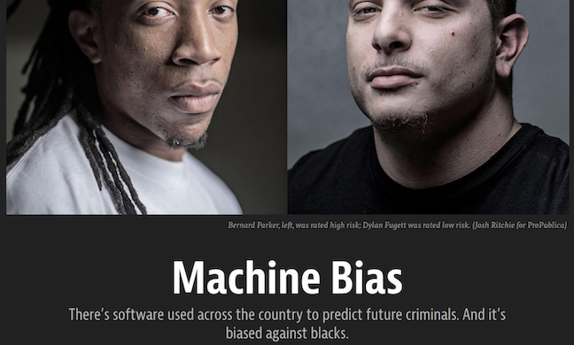
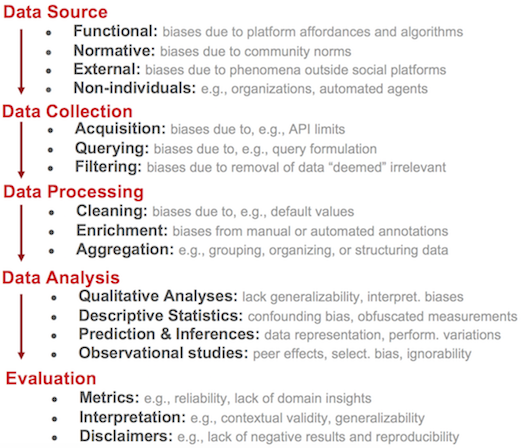
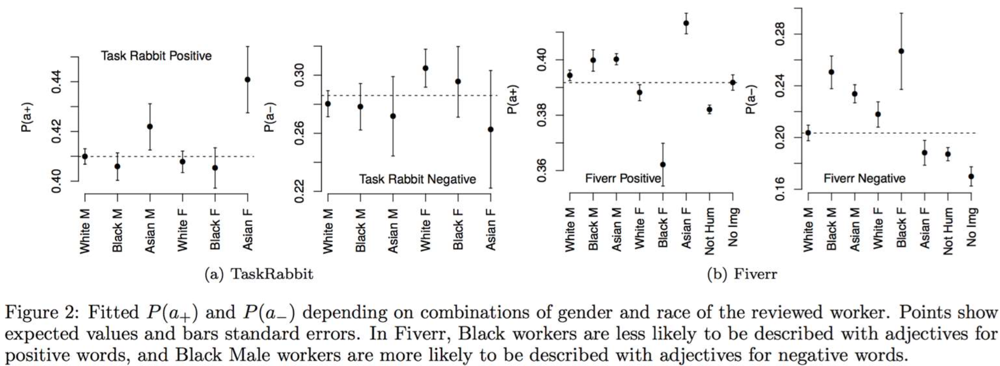
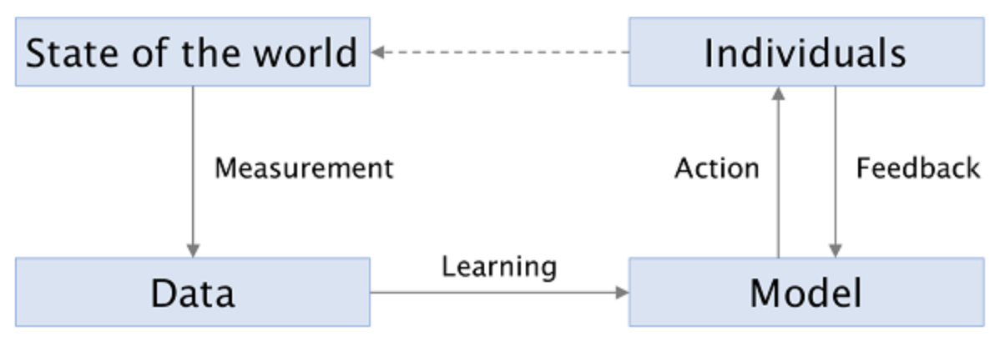

# Fairness: Beyond Model

Eunsuk Kang

<!-- references -->

Required reading: Os Keyes, Jevan Hutson, Meredith Durbin. [A Mulching Proposal: Analysing and Improving an Algorithmic System for Turning the Elderly into High-Nutrient Slurry](https://dl.acm.org/doi/pdf/10.1145/3290607.3310433). CHI Extended Abstracts, 2019.

---
# Learning Goals

* Consider achieving fairness in AI-based systems as an activity throughout the entire development cycle
* Understand the role of requirements engineering in selecting ML
  fairness criteria
* Understand the process of constructing datasets for fairness
* Consider the potential impact of feedback loops on AI-based systems
  and need for continuous monitoring

---
# Fairness Definitions: Review


----
## Review of definitions so far:

*Recidivism scenario: Should a person be detained?*

* Anti-classification: ?
* Independence: ?
* Separation: ?

<!-- split -->


<!-- .element: class="stretch" -->


----
## Review of definitions so far:

*Recidivism scenario: Should a defendant be detained?*

* Anti-classification: Race and gender should not be considered for the decision at all
* Independence: Detention rates should be equal across gender and race groups
* Separation: Among defendants who would not have gone on to commit a
violent crime if released, detention rates are equal across gender and race groups


----
## Recidivism Revisited



* COMPAS system, developed by Northpointe
	* Used by judges in sentencing decisions
	* In deployment throughout numerous states (PA, FL, NY, WI, CA, etc.,)

<!-- references -->

[ProPublica article](https://www.propublica.org/article/machine-bias-risk-assessments-in-criminal-sentencing)


----
## Which fairness definition?


* ProPublica investigation: COMPAS violates separation w/ FPR & FNR
* Northpointe response: COMPAS is fair because it has similar FDRs
  across both races
  * FDR = FP / (FP + TP) = 1 - Precision
  * FPR = FP / (FP + TN)
* __Q. So is COMPAS both fair & unfair at the same time? Which definition
  is the "right" one?__

<!--references -->

[Figure from Big Data and Social Science, Ch. 11](https://textbook.coleridgeinitiative.org/chap-bias.html#ref-angwin2016b)


----
## Fairness Definitions: Pitfalls 


<!-- .element: class="stretch" -->

* Easy to pick some definition & claim that the model is fair
  * But is the __overall system__ actually fair?
* In general, impossible to satisfy multiple fairness definitions at
once
	* Fairness is a __context-dependent__ notion
	* Select the criteria that minimize harm for the given context
	* Also consider trade-offs against accuracy

----
## Requirements & Fairness


<!-- .element: class="stretch" -->

* Fairness is a __context-dependent__ notion
* __Again, think about requirements!__
  * Who are the stakeholders of the system?
	* Which of these groups could be harmed?
  * What potential harms can be caused by biased decisions?
	* e.g., unfair punishments, denial to resources
  * Are there any legal constraints or policy goals?
	* e.g., 80% rule, affirmative actions 
  * How are these decisions related to the ML model? Errors?
	* e.g., false positives, false negatives
  * Which fairness metric minimizes the harm?


----
## Recall: Fairness Tree


[Full tree](http://www.datasciencepublicpolicy.org/wp-content/uploads/2021/04/Fairness-Full-Tree.png)


----
## Example: Automated Hiring


<!-- .element: class="stretch" -->

* Who are the groups possibly harm by biased decisions?
* What kind of harm can be caused?
* Which fairness metric to use?
  * Independence, separation w/ FPR vs. FNR?


---
# Building Fair ML Systems

----
## Fairness must be considered throughout the ML lifecycle!


<!-- references -->

_Fairness-aware Machine Learning_, Bennett et al., WSDM Tutorial (2019).


----
## Practitioner Challenges

* Fairness is a system-level property
  - consider goals, user interaction design, data collection, monitoring, model interaction (properties of a single model may not matter much)
* Fairness-aware data collection, fairness testing for training data
* Identifying blind spots
  - Proactive vs reactive
  - Team bias and (domain-specific) checklists
* Fairness auditing processes and tools
* Diagnosis and debugging (outlier or systemic problem? causes?)
* Guiding interventions (adjust goals? more data? side effects? chasing mistakes? redesign?)
* Assessing human bias of humans in the loop


<!-- references -->
Holstein, Kenneth, Jennifer Wortman Vaughan, Hal Daumé III, Miro Dudik, and Hanna Wallach. "[Improving fairness in machine learning systems: What do industry practitioners need?](http://users.umiacs.umd.edu/~hal/docs/daume19fairness.pdf)" In Proceedings of the 2019 CHI Conference on Human Factors in Computing Systems, pp. 1-16. 2019.


---
# Dataset Construction for Fairness


----
## Flexibility in Data Collection

* Data science education often assumes data as given
* In industry, we often have control over data collection and curation (65%)
* Most address fairness issues by collecting more data (73%)


<!-- references -->

[Challenges of incorporating algorithmic fairness into practice](https://www.youtube.com/watch?v=UicKZv93SOY),
FAT* Tutorial, 2019  ([slides](https://bit.ly/2UaOmTG))

----
## Data Bias



* Bias can be introduced at any stage of the data pipeline!

<!-- references -->

Bennett et al., [Fairness-aware Machine Learning](https://sites.google.com/view/wsdm19-fairness-tutorial), WSDM Tutorial (2019).


----
## Types of Data Bias

* __Population bias__
* __Historical bias__
* __Behavioral bias__
* Content production bias
* Linking bias
* Temporal bias

<!-- references -->

_Social Data: Biases, Methodological Pitfalls, and Ethical
Boundaries_, Olteanu et al., Frontiers in Big Data (2016).

----
## Population Bias


* Differences in demographics between a dataset vs a target population
* May result in degraded services for certain groups (e.g., poor
  image recognition for females & darker skin types)

----
## Historical Bias


<!-- .element: class="stretch" -->

* Dataset matches the reality, but certain groups are under- or
over-represented due to historical reasons

----
## Behavioral Bias



* Differences in user behavior across platforms or social contexts
* Example: Freelancing platforms (Fiverr vs TaskRabbit)
  * Bias against certain minority groups on different platforms

<!-- references -->

_Bias in Online Freelance Marketplaces_, Hannak et al., CSCW (2017).

----
## Fairness-Aware Data Collection

* Address population bias
<!-- .element: class="fragment" -->
  * Does the dataset reflect the demographics in the target
  population?
  * If not, collect more data to achieve this
* Address under- & over-representation issues
<!-- .element: class="fragment" -->
	* Ensure sufficient amount of data for all groups to avoid being
	treated as "outliers" by ML
	* Also avoid over-representation of certain groups (e.g.,
     remove historical data)
* Data augmentation: Synthesize data for minority groups to reduce under-representation
  <!-- .element: class="fragment" -->
  * Observed: "He is a doctor" -> synthesize "She is a doctor"
* Fairness-aware active learning
  <!-- .element: class="fragment" -->
  * Evaluate accuracy across different groups
  * Collect more data for groups with highest error rates 
	
<!-- references -->

_Fairness-aware Machine Learning_, Bennett et al., WSDM Tutorial (2019).

----
## Data Sheets


* A process for documenting datasets
* Common practice in the electronics industry, medicine
* Purpose, provenance, creation, __composition__, distribution
  * "Does the dataset relate to people?"
  * "Does the dataset identify any subpopulations (e.g., by age,
  gender)?"

<!-- references -->

_Datasheets for Dataset_, Gebru et al., (2019). https://arxiv.org/abs/1803.09010

----
## Model Cards


See also: https://modelcards.withgoogle.com/about

<!-- references -->

Mitchell, Margaret, et al. "[Model cards for model reporting](https://www.seas.upenn.edu/~cis399/files/lecture/l22/reading2.pdf)." In Proceedings of the Conference on fairness, accountability, and transparency, pp. 220-229. 2019.


----
## Model Exploration


<!-- .element: class="stretch" -->

[Google What-If Tool](https://pair-code.github.io/what-if-tool/demos/compas.html)

----
## Breakout: Data Collection for Fairness


* For each system, discuss:
  * What are possible types of bias in the data?
	* Population bias? Under- or over-representation?
  * How would you modify the dataset reduce bias?
	* Collect more data? Remove? Augment?

---
# Monitoring and Auditing


----
## Feedback Loops

```mermaid
graph LR
  t[biased training data] --> o[biased outcomes]
  o --> m[biased telemetry] 
  m --> t
  ```

> "Big Data processes codify the past.  They do not invent the future.  Doing that requires moral imagination, and that’s something only humans can provide. " -- Cathy O'Neil in [Weapons of Math Destruction](https://cmu.primo.exlibrisgroup.com/permalink/01CMU_INST/6lpsnm/alma991016462699704436)


----
## Example: Predictive Policing


<!-- .element: class="stretch" -->


* Model: Use historical data to predict crime rates by neighborhoods
* Increased patrol => more arrested made in neighborhood X
* New crime data fed back to the model
* Repeat...

__Q. Other examples?__

----
## Long-term Impact of ML



* ML systems make multiple decisions over time, influence the
behaviors of populations in the real world
* But most models are built & optimized assuming that the world is
static!
* Difficult to estimate the impact of ML over time
  * Need to reason about the system dynamics (world vs machine)
  * e.g., what's the effect of a loan lending policy on a population?

----
## Long-term Impact & Fairness


* Deploying an ML model with a fairness criterion does NOT guarantee
  improvement in equality over time
* Even if a model appears to promote fairness in
short term, it may result harm over a long-term period

<!-- references -->
[Fairness is not static: deeper understanding of long term fairness via simulation studies](https://dl.acm.org/doi/abs/10.1145/3351095.3372878),
in FAT* 2020.

----
## Monitoring & Auditing

* Continuously monitor for:
  - Match between training data, test data, and instances that you encounter in deployment
  - Fairness metrics: Is the system yielding fair results over time?
  - Population shifts: May suggest needs to adjust fairness metric/thresholds
  - User reports & complaints: Log and audit system decisions
    perceived to be unfair by users
* Deploy escalation plans: How do you respond when harm occurs due to
system?
	* Shutdown system? Temporary replacement?
	* Maintain communication lines to stakeholders
* Invite diverse stakeholders to audit system for biases

----
## Monitoring Tools: Example


http://aequitas.dssg.io/

----
## Monitoring Tools: Example


* Continuously make fairness measurements to detect potential shifts
  in data, population behavior, etc.,

----
## Monitoring Tools: Example


* Involve policy makers in the monitoring & auditing process


---
## Fairness: Final Thoughts

__START EARLY!__

* Think about system goals and relevant fairness concerns
* Analyze risks & harms to affected groups
* Understand environment interactions, attacks, and feedback loops (world vs machine)
* Influence data acquisition
* Define quality assurance procedures
  - separate test sets, automatic fairness measurement, testing in production
  - telemetry design and feedback mechanisms
  - incidence response plan

----
## Fairness Checklist


<!-- references -->

[_Co-Designing Checklists to Understand Organizational
Challenges and Opportunities around Fairness in AI_](http://www.jennwv.com/papers/checklists.pdf), Madaio et al (2020).

---
# Summary

* Achieving fairness as an activity throughout the entire development cycle
* Requirements engineering for fair ML systrems
  * Stakeholders, sub-populations & unfair (dis-)advantages
  * Types of harms
  * Legal requirements
* Dataset construction for fairness
* Consideration for the impact of feedback loops
* Continous montoring & auditing for fairness

