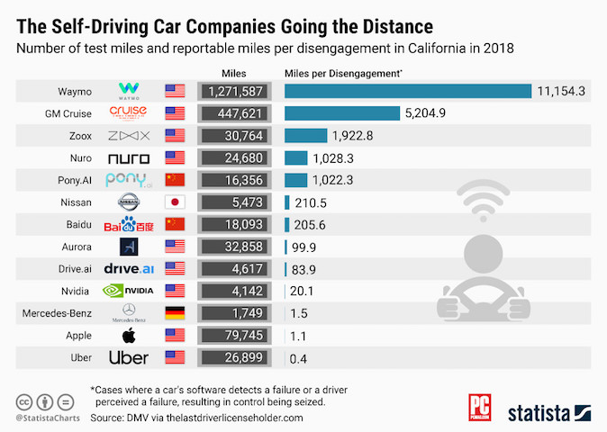
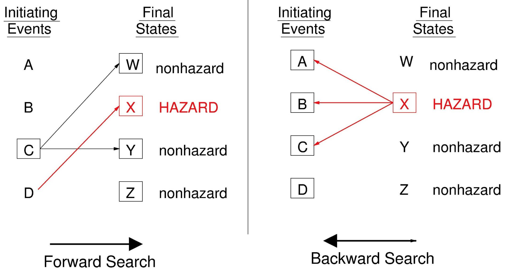
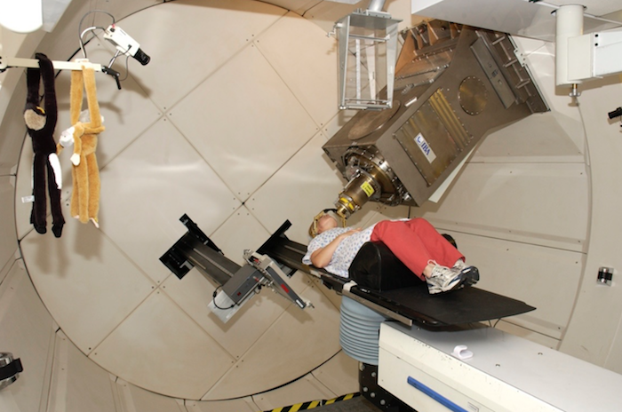
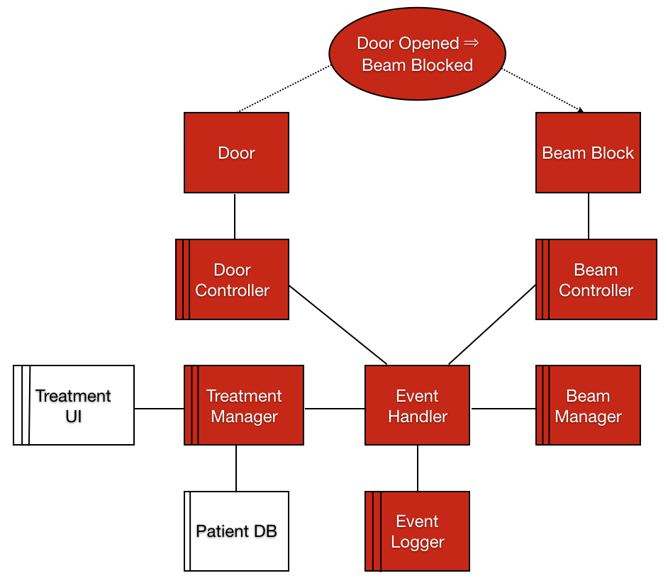
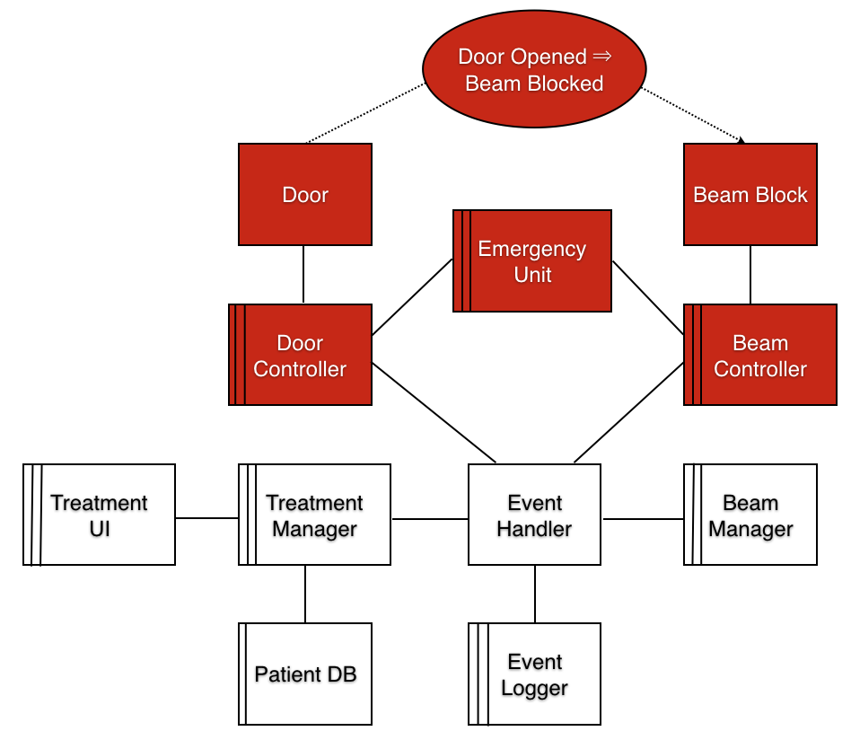
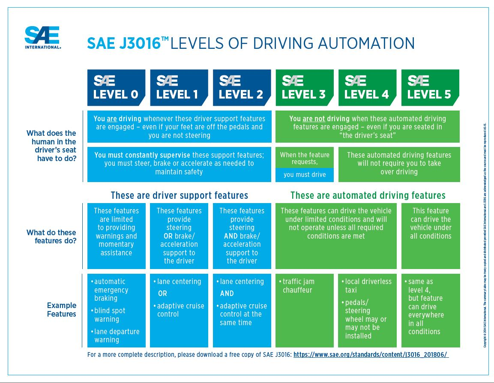
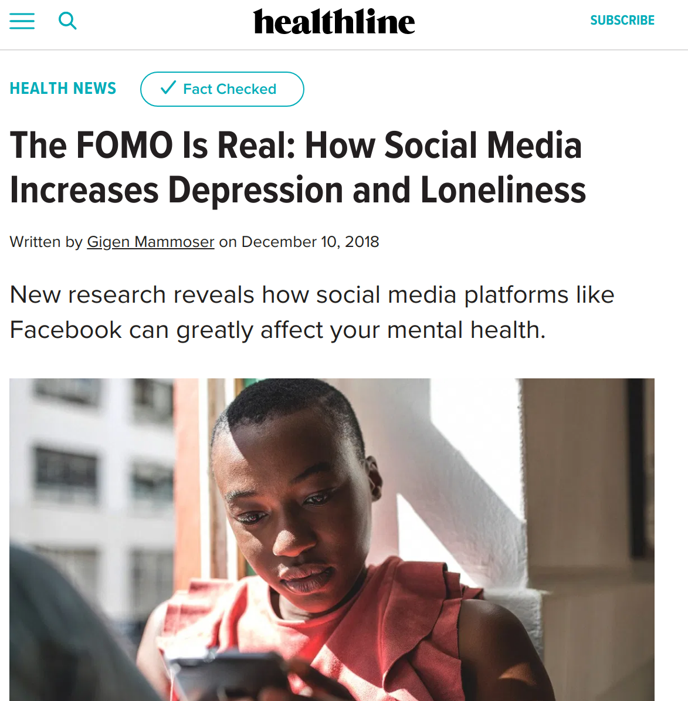
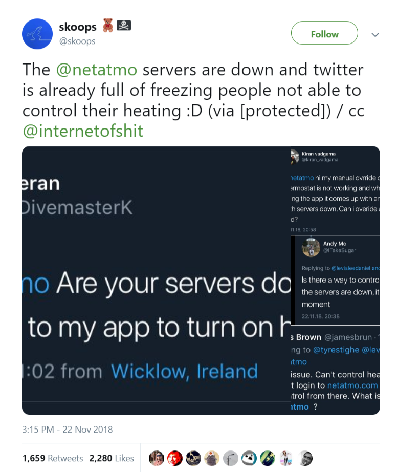

# Safety

Christian Kaestner

With slides from Eunsuk Kang

<!-- references -->

Required Reading 🗎 Salay, Rick, Rodrigo Queiroz, and Krzysztof Czarnecki. "[An analysis of ISO 26262: Using machine learning safely in automotive software](https://arxiv.org/pdf/1709.02435)." arXiv preprint arXiv:1709.02435 (2017).

---
# Learning Goals

* Understand safety concerns in traditional and AI-enabled systems
* Apply hazard analysis to identify risks and requirements and understand their limitations
* Discuss ways to design systems to be safe against potential failures 
* Suggest safety assurance strategies for a specific project
* Describe the typical processes for safety evaluations and their limitations

---
# Safety

----
## Defining Safety

* Prevention of a system failure or malfunction that results in:
  * Death or serious injury to people
  * Loss or severe damage to equipment/property
  * Harm to the environment or society
+ Safety != Reliability
  * Can build safe systems from unreliable components (e.g. redundancies)
  * Reliable components may be unsafe (e.g. stronger gas tank causes more severe damage in incident)
  * Safety is a system concept

----
## Examples of Harm from AI-Enabled Systems?

<!-- discussion -->

----
## Safety

----
## Safety

----
## Safety

----
## Safety Challenge widely Recognized

(survey among automotive engineers)

<!-- references -->
Borg, Markus, et al. "[Safely entering the deep: A review of verification and validation for machine learning and a challenge elicitation in the automotive industry](https://arxiv.org/pdf/1812.05389)." arXiv preprint arXiv:1812.05389 (2018).

----
## Safety is a broad concept

* Includes harm to mental health
* Includes polluting the environment, including noise pollution
* Includes harm to society, e.g. poverty, polarization

----
## Case Study: Self-Driving Car

----
## How did traditional vehicles become safe?

* National Traffic & Motor Safety Act (1966): Mandatory design changes (head rests, shatter-resistant windshields, safety belts); road improvements (center lines, reflectors, guardrails)

----
## Autonomous Vehicles: What's different?

**Challenges?**

----
## Autonomous Vehicles: What's different?

* In traditional vehicles, humans ultimately responsible for safety
  * Some safety features (lane keeping, emergency braking) designed to
  help & reduce risks
  * i.e., safety = human control + safety mechanisms
* Use of AI in autonomous vehicles: Perception, control, routing,
etc.,
  * Inductive training: No explicit requirements or design insights
  * __Can ML achieve safe design solely through lots of data?__

----
## Challenge: Edge/Unknown Cases

* Gaps in training data; ML will unlikely to cover all unknown cases
* __Why is this a unique problem for AI__? What about humans?

----
## Demonstrating Safety

__More miles tested => safer?__

----
## Approach for Demonstrating Safety

* Identify relevant hazards & safety requirements
* Identify potential root causes for hazards
* For each hazard, develop a mitigation strategy
* Provide evidence that mitigations are properly implemented

---
# Hazard Analysis

(system level!)

----
## What is Hazard Analysis?

* __Hazard__: A condition or event that may result in undesirable outcome
  * e.g., "Ego vehicle is in risk of a collision with another vehicle."
* __Safety requirement__: Intended to eliminate or reduce one or more hazards
  * "Ego vehicle must always maintain some minimum safe distance to the leading vehicle."
* __Hazard analysis__: Methods for identifying hazards & potential root causes 

----
## Recall: Requirement vs Specification

* __REQ__: Ego vehicle must always maintain some minimum safe
distance to the leading vehicle. 
* __ENV__: Engine is working as intended; sensors are providing
  accurate information about the leading car (current speed, distance...)
* __SPEC__: Depending on the sensor readings, the controller must
  issue an actuator command to accelerate/decelerate the vehicle as needed.

----
## Recall: World vs Machine

Software is not unsafe; the control signals it generates may be

Root of unsafety usually in wrong requirements

----
## Forward vs Backward Search

----
## Recall: Fault Tree Analysis (FTA)

* Top-down, __backward__ search method for root cause analysis
  * Start with a given hazard (top event), derive a set of component
    faults (basic events)
  * Compute minimum cutsets as potential root causes

----
## Recall: Failure Mode and Effects Analysis

* A __forward search__ technique to identify potential hazards
* Widely used in aeronautics, automotive, healthcare, food services,
  semiconductor processing, and (to some extent) software

----
## FMEA Example: Autonomous Vehicles

* Architecture of the Apollo autonomous driving platform 

----
## FMEA Example: Autonomous Vehicles

| Component | Failure Mode | Failure Effects | Detection | Mitigation |
|---|---|---|---|---|
| Perception | Failure to detect an object | Risk of collision | Human operator (if present) | Deploy secondary classifier |
| Perception | Detected but misclassified | " | " | " |
| Lidar Sensor | Mechanical failure | Inability to detect objects | Monitor | Switch to manual control mode |
| ... | ... | ... | ... |  ... | 

----
## Recall: Hazard and Operability Study

* A __forward search__ method to identify potential hazards
* For each component, use a set of __guide words__ to generate
possible deviations from expected behavior
* Consider the impact of each generated deviation: Can it
  result in a system-level hazard?

----
## HAZOP Example: Emergency Braking (EB)

* Specification: EB must apply a maximum braking
command to the engine.
  * __NONE__: EB does not generate any braking command.
  * __LESS__: EB applies less than max. braking.
  * __LATE__: EB applies max. braking but after a delay of 2
  seconds.
  * __REVERSE__: EB generates an acceleration command instead of braking.
  * __BEFORE__: EB applies max. braking before a possible crash is detected.

----
## HAZOP Exercise: Autonomous Vehicles

* Architecture of the Apollo autonomous driving platform 

----
## HAZOP Exercise: Perception

* What is the specification of the perception component?
* Use HAZOP to answer:
  * What are possible deviations from the specification?
  * What are potential hazards resulting from these deviations?

----
## HAZOP: Benefits & Limitations

* Easy to use; encourages systematic reasoning about component faults
* Can be combined with FTA/FMEA to generate faults (i.e., basic
events in FTA)
* Potentially labor-intensive; relies on engineer's judgement
* Does not guarantee to find all hazards (but also true for other techniques)

----
## Remarks: Hazard Analysis

* None of these method guarantee completeness
  * You may still be missing important hazards, failure modes
* Intended as structured approaches to thinking about failures
  * But cannot replace human expertise and experience
* When available, leverage prior domain knowledge 
  * __Safety standards__: A set of design and process guidelines for
    establishing safety
  * ISO 26262, ISO 21448, IEEE P700x, etc., 
  * Most do not consider AI; new standards being developed (e.g., UL
    4600)

---
# Model Robustness

----
## Recall: Defining Robustness

* A prediction for $x$ is robust if the outcome is stable under minor perturbations of the input
  - $\forall x'. d(x, x')<\epsilon \Rightarrow f(x) = f(x')$
  - distance function $d$ and permissible distance $\epsilon$ depends on problem
* A model is robust if most predictions are robust

----
## Robustness in a Safety Setting

* Does the model reliably detect stop signs?
* Also in poor lighting? In fog? With a tilted camera?
* With stickers taped to the sign?

<!-- references -->

Image: David Silver. [Adversarial Traffic Signs](https://medium.com/self-driving-cars/adversarial-traffic-signs-fd16b7171906). Blog post, 2017

----
## Robustness Verification for Safety

* Rely only on predictions that are robust
  - online verification, smoothing
* Detect outliers in inputs
* Learn more robust models
  - data augmentation, simulation
  - and many other strategies (see security lecture)

----
## Testing for Safety

* Curate data sets for critical scenarios (see model quality lecture)
* Create test data for difficult settings (e.g. fog)
* Simulation feasible? Shadow deployment feasible?

---
# Other AI Safety Concerns

 
<!-- references -->
Amodei, Dario, Chris Olah, Jacob Steinhardt, Paul Christiano, John Schulman, and Dan Mané. "[Concrete problems in AI safety](https://arxiv.org/pdf/1606.06565.pdf%20http://arxiv.org/abs/1606.06565)." arXiv preprint arXiv:1606.06565 (2016).

----
## Negative Side Effects

----
## Negative Side Effects

* Challenge: Define good goal/cost function
* Design in system context, beyond the model
* "Perform X" --> "perform X *subject to common-sense constraints on the environment*" or "perform X *but avoid side effects to the extent possible*"

**Other examples?**

<!-- references -->
Amodei, Dario, Chris Olah, Jacob Steinhardt, Paul Christiano, John Schulman, and Dan Mané. "[Concrete problems in AI safety](https://arxiv.org/pdf/1606.06565.pdf%20http://arxiv.org/abs/1606.06565)." arXiv preprint arXiv:1606.06565 (2016).

Note: An self-driving car may break laws in order to reach a destination faster

----
## Reward Hacking

> PlayFun algorithm pauses the game of Tetris indefinitely to avoid losing  

>When about to lose a hockey game, the PlayFun algorithm exploits a bug to make one of the players on the opposing team disappear from the map, thus forcing a draw.

> Self-driving car rewarded for speed learns to spin in circles  

> Self-driving car figures out that it can avoid getting penalized for driving
too close to other cars by exploiting certain sensor vulnerabilities so that it can’t “see” how close it is getting

----
## Reward Hacking

* AI can be good at finding loopholes to achieve a goal in unintended ways
* Technically correct, but does not follow *designer's informal intend*
* Many reasons, incl. partially observed goals, abstract rewards, proxies, feedback loops
* Challenging to specify goal and reward function properly

**Other examples?**

<!-- references -->
Amodei, Dario, Chris Olah, Jacob Steinhardt, Paul Christiano, John Schulman, and Dan Mané. "[Concrete problems in AI safety](https://arxiv.org/pdf/1606.06565.pdf%20http://arxiv.org/abs/1606.06565)." arXiv preprint arXiv:1606.06565 (2016).

----
## Reward Hacking -- Many Examples

----
## Other Challenges

* Scalable Oversight
  - Cannot provide human oversight over every action (or label all possible training data)
  - Use indirect proxies in telemetry to assess success/satisfaction
  - Training labels may not align well with goals
  - -> Semi-supervised learning? Distant supervision?
* Safe Exploration
  - Exploratory actions "in production" may have consequences
  - e.g., trap robots, crash drones
  - -> Safety envelopes and other strategies to explore only in safe bounds (see also chaos engineering)
* Robustness to Drift
  - Drift may lead to poor performance that may not even be recognized
  - -> Check training vs production distribution (see data quality lecture), change detection, anomaly detection

<!-- references -->
Amodei, Dario, Chris Olah, Jacob Steinhardt, Paul Christiano, John Schulman, and Dan Mané. "[Concrete problems in AI safety](https://arxiv.org/pdf/1606.06565.pdf%20http://arxiv.org/abs/1606.06565)." arXiv preprint arXiv:1606.06565 (2016).

---
# Designing for Safety

----
## Elements of Safe Design

* __Assume__: Components will fail at some point
* __Goal__: Minimize the impact of failures on safety
* __Detection__
  * Monitoring
* __Control__
  * Graceful degradation (fail-safe)
  * Redundancy (fail over)
* __Prevention__
  * Decoupling & isolation

----
## Detection: Monitoring

* __Goal__: Detect when a component failure occurs
* __Heartbeat__ pattern
  * Periodically sends diagnostic message to monitor
* __Doer-Checker__ pattern
  * Doer: Perform primary function; untrusted and potentially faulty
  * Checker: If doer output faulty, perform corrective action
    (e.g., default safe output, shutdown); trusted and verifiable

----
## Doer-Checker Example: Autonomous Vehicle

* ML-based controller (__doer__): Generate commands to maneuver vehicle
  * Complex DNN; makes performance-optimal control decisions
* Safety controller (__checker__): Checks commands from ML controller; overrides it
  with a safe default command if maneuver deemed risky
  * Simpler, based on verifiable, transparent logic; conservative control

----
## Response: Graceful Degradation (Fail-safe)

<video>
    <source data-src="rc-car.mp4" type="video/mp4" />
</video>

* __Goal__: When a component failure occurs, continue to provide
  safety (possibly at reduced functionality and performance)
* Relies on a monitor to detect component failures
* Example: Perception in autonomous vehicles
  * If Lidar fails, switch to a lower-quality detector; be more
  conservative
  * __But what about other types of ML failures? (e.g., misclassification)__

----
## Response: Redundancy (Failover)

* __Goal__: When a component fails, continue to provide the same
  functionality 
* __Hot Standby__: Standby watches & takes over when primary fails
* __Voting__: Select the majority decision
* Caution: Do components fail independently?
  * Reasonable assumption for hardware/mechanical failures
  * __Q. What about software?__

----
## Response: Redundancy (Failover)

* __Goal__: When a component fails, continue to provide the same
  functionality 
* __Hot Standby__: Standby watches & takes over when primary fails
* __Voting__: Select the majority decision
* Caution: Do components fail independently?
  * Reasonable assumption for hardware/mechanical failures
  * Software: Difficult to achieve independence even when built by
    different teams (e.g., N-version programming)
  * __Q. ML components?__

----
## Prevention: Decoupling & Isolation

* __Goal__: Faults in a low-critical (LC) components should not impact
  high-critical (HC) components

----
## Poor Decoupling: USS Yorktown (1997)

* Invalid data entered into DB; divide-by-zero crashes entire network
* Required rebooting the whole system; ship dead in water for 3 hours 
* __Lesson__: Handle expected component faults; prevent propagation

----
## Poor Decoupling: Automotive Security

* Main components connected through a common CAN bus
  * Broadcast; no access control (anyone can read/write)
* Can control brake/engine by playing a malicious MP3 (Stefan Savage, UCSD)

----
## Prevention: Decoupling & Isolation

* Goal: Faults in a low-critical (LC) components should not impact
  high-critical (HC) components
* Apply the principle of least privilege
  * LC components should be allowed to access min. necessary data 
* Limit interactions across criticality boundaries
  * Deploy LC & HC components on different networks
  * Add monitors/checks at interfaces
* Identify and eliminate implicit interactions
  * Memory: Shared memory, global variables
  * CPU resources: LC tasks running at high-priority, starving HC tasks
* Is AI in my system performing an LC or HC task?
  * If HC, can we "demote" it into LC?

----
## Example: Radiation Therapy

* __Safety requirement__: If door opens during treatment, insert beam block.

----
## Existing Design

* Which components are responsible for establishing this safety requirement
(e.g., high critical)?
* Existing design includes:
  * Pub/sub event handler: 3rd-party library; missing source code;
    company went bankrupt
  * Event logging: May throw an error if disk full
  * Event handler/logging used by all tasks, including LC ones
* Is it possible to achieve high confidence that these HC components don't fail?

<!-- split -->

----
## Alternative Design

* Build in an emergency unit
  * Bypass event handler for HC tasks
* Still needs to rely on door & beam controllers
  * Can't eliminate the risk of failure, but significantly reduce it
  * Emergency unit simpler, can be verified & tested
  
<!-- split -->

----
## ML as Unreliable Components

* Symbolic AI can provide guarantees
* ML models may make mistakes, no specifications
  - see also ML as requirements engineering?
* Mistakes are hard to predict or understand
  - Does interpretability help?
* Mistakes are not independent or uniformly distributed
  - Classic redundancy mechanisms may not work?

---
# Self-Driving Cars

----

Note: Driving in controlled environments vs public roads

----
## ISO 26262

* Current standards not prepared for machine learning
* Assume specifications and corresponding testing

<!-- references -->
* Salay, Rick, Rodrigo Queiroz, and Krzysztof Czarnecki. "[An analysis of ISO 26262: Using machine learning safely in automotive software](https://arxiv.org/pdf/1709.02435)." arXiv preprint arXiv:1709.02435 (2017).
* Salay, Rick, and Krzysztof Czarnecki. "[Using machine learning safely in automotive software: An assessment and adaption of software process requirements in ISO 26262](https://arxiv.org/pdf/1808.01614)." arXiv preprint arXiv:1808.01614 (2018).

----
## ML-Specific Fault Tolerance Patterns

* Ensemble learning methods 
  - e.g. multiple classifiers for pedestrian detection
* Safety envelope (hard-coded constraints on safe solutions)
  - e.g. combine ML-based pedestrian detector with programmed object detector for obstacle avoidance
* Simplex architecture (conservative approach on low-confidence predictions)
  - e.g. slow down if obstacle is detected, but kind/trajectory of obstacle unclear
* Runtime verification + Fail Safety (partial specs)
  - e.g. detect whether detected pedestrian detector behavior violates partial specification at runtime (plausibility checks)
* Data harvesting (keep low confidence data for labeling and training)
  - e.g. pedestrian detector's safe low confidence predictions saved for offline analysis

<!-- references -->
Salay, Rick, and Krzysztof Czarnecki. "[Using machine learning safely in automotive software: An assessment and adaption of software process requirements in ISO 26262](https://arxiv.org/pdf/1808.01614)." arXiv preprint arXiv:1808.01614 (2018).

----
## The Uber Crash

Note:
 > investigators instead highlighted the many human errors that culminated in the death of 49-year-old Elaine Herzberg. Driver was reportedly streaming an episode of The Voice on her phone, which is in violation of Uber’s policy banning phone use. In fact, investigators determined that she had been glancing down at her phone and away from the road for over a third of the total time she had been in the car up until the moment of the crash.

 > woefully inadequate safety culture

 > federal government also bore its share of responsibility for failing to better regulate autonomous car operations
 
 > The company also lacked a safety division and did not have a dedicated safety manager responsible for risk assessment and mitigation. In the weeks before the crash, Uber made the fateful decision to reduce the number of safety drivers in each vehicle from two to one. That decision removed important redundancy that could have helped prevent Herzberg’s death.

 (from https://www.theverge.com/2019/11/20/20973971/uber-self-driving-car-crash-investigation-human-error-results)

----
## SAE Self-Driving Levels
<!-- smallish -->

* Level 0: No automation
* Level 1: Driver assistance
  - Speed xor steering in certain conditions; e.g. adaptive cruise control
  - Driver fully active and responsible
* Level 2: Partial automation
  - Steer, accelerate and break in certain circumstances, e.g. Tesla Autopilot
  - Driver scans for hazards and initiates actions (lane changes)
* Level 3: Conditional automation
  - Full automation in some conditions, Audi Traffic Jam Pilot
  - Driver takes over when conditions not met
* Level 4: High automation
  - Full automation in some areas/conditions, e.g. highways in good weather
  - No driver involvement in restricted areas
* Level 5: Full automation
  - Full automation on any road and any condition where human could drive

<!-- references -->
SAE Standard J3016

----

----
## Robustness Defense

*Use map with known signs as safety mechanism for hard to recognize signs*

----
## Bugs in Self-Driving Cars

* Study of 499 bugs of autonomous driving systems during development
* Many traditional development bugs, including configuration bugs (27%), build errors (16%), and documentation bugs
* All major components affected (planning 27%, perception 16%, localization 11%)
* Bugs in algorithm implementations (28%), often nontrivial, many symptoms
* Few safety-relevant bugs

<!-- references -->
Garcia, Joshua, Yang Feng, Junjie Shen, Sumaya Almanee, Yuan Xia, and Qi Alfred Chen. "[A Comprehensive Study of Autonomous Vehicle Bugs](https://www.junjieshen.com/assets/pub/icse20-av-bugs.pdf)." ICSE 2020

----
## Safety Challenges widely Recognized

<!-- references -->
Borg, Markus, et al. "[Safely entering the deep: A review of verification and validation for machine learning and a challenge elicitation in the automotive industry](https://arxiv.org/pdf/1812.05389)." arXiv preprint arXiv:1812.05389 (2018).

----
## Challenges discussed for Self-Driving Cars

* No agreement on how to best develop safety-critical DNN
* Research focus on showcasing attacks or robustness improvements rather than (system-level) engineering practices and processes
* Pioneering spirit of AI clashes with conservatism of safety engineering
* Practitioners prefer simulation and tests over formal/probabilistic methods
* No consensus on certification and regulation, gap in safety standards

<!-- references -->
Borg, Markus, et al. "[Safely entering the deep: A review of verification and validation for machine learning and a challenge elicitation in the automotive industry](https://arxiv.org/pdf/1812.05389)." arXiv preprint arXiv:1812.05389 (2018).

----
## Safety Cages

* Encapsulate ML component
* Observe, monitor with supervisor
* Anomaly/novelty/out-of-distribution detection
* Safe-track backup solution with traditional safety engineering without ML

<!-- references -->
Borg, Markus, et al. "[Safely entering the deep: A review of verification and validation for machine learning and a challenge elicitation in the automotive industry](https://arxiv.org/pdf/1812.05389)." arXiv preprint arXiv:1812.05389 (2018).

----
##  Automation complacency

---
# If Traditional Verification Doesn't Work, Now What?

----
## Safety Assurance with ML Components

* Consider ML components as unreliable, at most probabilistic guarantees
* Testing, testing, testing (+ simulation)
  - Focus on data quality & robustness
* *Adopt a system-level perspective!*
* Consider safe system design with unreliable components
  - Traditional systems and safety engineering
  - Assurance cases
* Understand the problem and the hazards
  - System level, goals, hazard analysis, world vs machine
  - Specify *end-to-end system behavior* if feasible
* Recent research on adversarial learning and safety in reinforcement learning 

----
## Follow Research

* Understand safety problems and safety properties
* Understand verification techniques (testing, formal, and probabilistic)
* Understand adversarial attack and defense mechanisms
* Anomaly detection, out of distribution detection, drift detection
* Advances in interpretability and explainability
* Human-ML interaction, humans in the loop designs and problems

<!-- references -->

Starting point: Huang, Xiaowei, Daniel Kroening, Wenjie Ruan, James Sharp, Youcheng Sun, Emese Thamo, Min Wu, and Xinping Yi. "[A survey of safety and trustworthiness of deep neural networks: Verification, testing, adversarial attack and defence, and interpretability](https://arxiv.org/pdf/1812.08342)." Computer Science Review 37 (2020): 100270.

----
## Don't Forget the Basics

* Hazard analysis
* Configuration management
* Requirements and design specifications
* Testing

---
# Beyond Traditional Safety Critical Systems

----
## Beyond Traditional Safety Critical Systems

* Recall: Legal vs ethical
* Safety analysis not only for regulated domains (nuclear power plants, medical devices, planes, cars, ...)
* Many end-user applications have a safety component 

**Examples?**

<!-- discussion -->

----
## Twitter

Notes: What consequences should Twitter have foreseen? How should they intervene now that negative consequences of interaction patterns are becoming apparent?

----
## Mental Health

----
## IoT

----
## Addiction

<!-- .element: class="stretch" -->

Notes: Infinite scroll in applications removes the natural breaking point at pagination where one might reflect and stop use.

----
## Addiction

----
## Society: Unemployment Engineering / Deskilling

Notes: The dangers and risks of automating jobs.

Discuss issues around automated truck driving and the role of jobs.

See for example: Andrew Yang. The War on Normal People. 2019

----
## Society: Polarization

<!-- .element: class="stretch" -->

Notes: Recommendations for further readings: https://www.nytimes.com/column/kara-swisher, https://podcasts.apple.com/us/podcast/recode-decode/id1011668648

Also isolation, Cambridge Analytica, collaboration with ICE, ...

----
## Environmental: Energy Consumption

----
## Exercise

*Look at apps on your phone. Which apps have a safety risk and use machine learning?*

Consider safety broadly: including stress, mental health, discrimination, and environment pollution

<!-- discussion -->

----
## Takeaway

* Many systems have safety concerns
* ... not just nuclear power plants, planes, cars, and medical devices
* Do the right thing, even without regulation
* Consider safety broadly: including stress, mental health, discrimination, and environment pollution
* Start with requirements and hazard analysis

---
# Summary

* *Adopt a safety mindset!*
* Defining safety: absence of harm to people, property, and environment
  - Beyond traditional safety critical systems, affects many apps and web services
* Assume all components will eventually fail in one way or another, especially ML components
* AI goals are difficult to specify precisely, reward hacking
* Hazard analysis to identify safety risks and requirements; classic safety design at the system level
* Model robustness can help with some problems
* Self-driving cars are challenging and evolving
